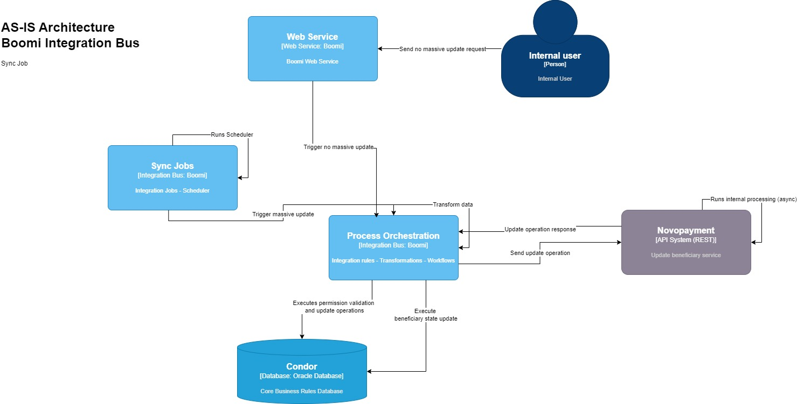
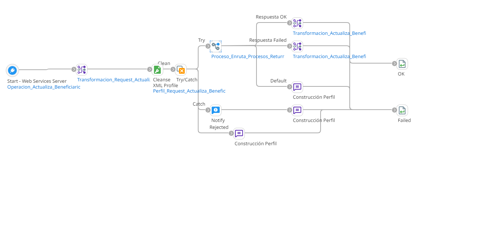
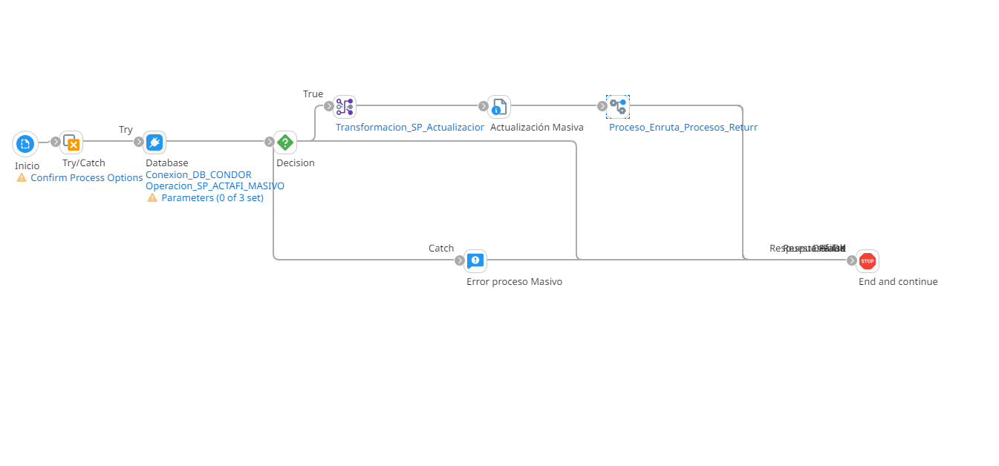
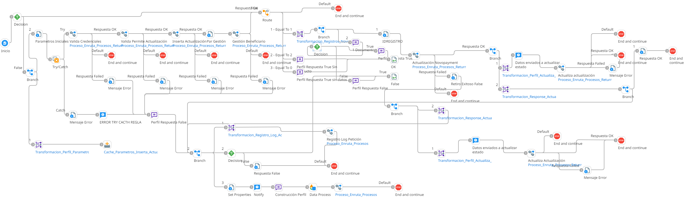

# Actualización Beneficiario

## ws_Actualizacion_Beneficiario
Frecuencia de ejecución: Segun demanda del usuario.

## job_Actualizacion_Beneficiario
Frecuencia de ejecución: Segun configuración del scheduler

### Sistemas involucrados: 

- Boomi Webhook
- Boomi Job
- Novopayment
- Condor BD Oracle

### Descripción general

Esta integración puede ser disparada por un job o por ejecución de un usuario.

En el caso de que el trigger de la integración sea la petición de un usario a traves del webservice, se validan los permisos del usuario en **Condor** y se realiza una serie de consultas de inserción/actualización mediante Store Procedures para actualizar los datos del beneficiario. Posteriormente se realiza una petición de actualización del beneficiario a **Novopayment**, y en caso de respuesta positiva del servicio, se procede a realizar una última actualización del estado de retiro del beneficiario en **Condor**.

En el caso de que el trigger de la integración sea el job, no se realizan las validaciones de permiso y actualización de los datos del beneficiario que se realizan en el caso de que el trigger sea el webservice, pero si se realiza la petición a **Novopayment** y la actualización del estado de retiro del beneficiario en **Condor**

Webhook: `ws_Actualizacion_Beneficiario`

El webhook se encarga de recibir la solicitud del usuario, controlar las excepciones ocurridas durante todo el proceso, enrutar a la regla de integración correspondiente y dar una respuesta a traves del endpoint

Job: `job_Actualizacion_Beneficiario`

Este job ejecuta periodicamente la regla de integración segun el scheduler configurado.

Subproceso principal (RI): `ri_Actualizacion_Beneficiario`
