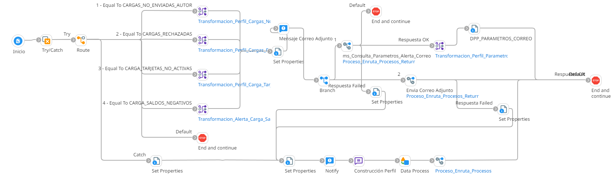

# ALERTAS CARGAS

## Job_Alerta_Carga_Saldos_Negativos Job_Alerta_Carga_Tarjetas_No_Activas job_Alerta_Cargas_No_Enviadas_Autor job_Alerta_Cargas_Rechazadas

Frecuencia de ejecucion: Programado

### Sistemas involucrados: 

- Condor BD Oracle

## Descripcion general:
Procesos Job sincronicos que generan las siguientes alertas:
### Cargas de saldos negativo
 es una notificación que se activa cuando una cuenta presenta un saldo inferior a cero
 ### Cargas tarjetas no activas
 indica la presencia de tarjetas en el sistema que aun no han sido activadas por sus titulares
 ### Cargas no enviadas autor
indica que hay archivos o datos que debebieron ser enviadas por el autor pero aun no han sido trasmitidos
### Cargas Rechazadas
indica que fue rechazado uno o varios archivos que se intentaron cargar

El proceso se inicia con la validación de un scheduler. Dependiendo del valor de 'Route Values', se lanza un job específico para generar alertas sobre cargas no enviadas por el autor, cargas rechazadas, tarjetas no activadas o saldos negativos. Para ello, se ejecutan en la base de datos Condor los SP correspondientes `SP_SALDOS_NEGATIVOS, SP_CARGAS_TARJETASNOACTIVAS, SP_CARGAS_NOENVIADAS_AUTOR, SP_CARGAS_RECHAZADAS`. Si se cumplen las condiciones iniciales, se ejecuta `SP_GET_ALERTACORREO` para enviar una notificación por correo electrónico.

### Actividades del proceso: 
Subproceso principal: `ri_Alerta_Cargas_Comunes`

