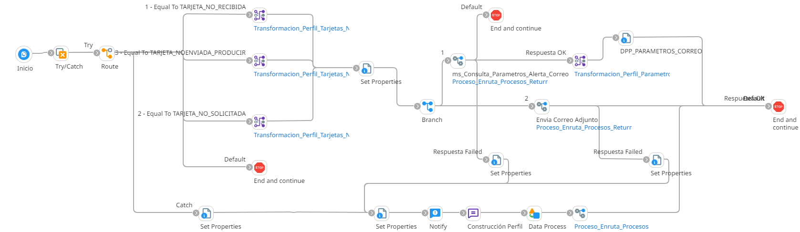

# ALERTAS EMISION

## job_Alerta_Tarjeta_No_Recibida, job_Alerta_Tarjeta_No_Solicitada, Job_Alerta_Tarjeta_No_Enviada_Producir

Frecuencia de ejecucion: Programado

### Sistemas involucrados: 

- Condor BD Oracle

## Descripcion general:
Procesos Job sincronicos que generan las siguientes alertas:
### Tarjeta no recibida
 es una notificación que se activa cuando las tarjetas solicitadas no han sido entregadas al destino indicado
 ### Tarjeta no solicitada
es una alerta que indica que las tarjetas no fueron solicitadas por el cliente
 ### Tarjeta no enviada a producir
indica que las tarjetas solicitdas no han sido enviadas a produccion

El proceso se inicia con la validación de un scheduler. Dependiendo del valor de 'Route Values', se lanza un job específico para generar alertas sobre tarjetas no recibidas, tarjetas no solicitadas, tarjetas no enviadas a producir. Para ello, se ejecutan en la base de datos Condor los SP correspondientes `SP_TARJ_NORECIBIDASXDISPAPELES, SP_TARJ_NOSOLICITADAS_AUTOR, SP_TARJ_NOENVIADAS_A_PRODUCIR`. Si se cumplen las condiciones iniciales, se ejecuta `SP_GET_ALERTACORREO` para enviar una notificación por correo electrónico.

### Actividades del proceso: 
Subproceso principal: `ri_Alerta_Tarjeta_Comunes`

