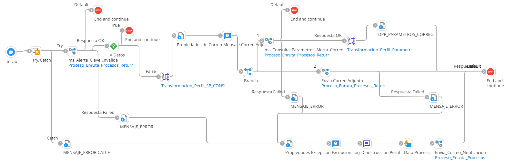

# ALERTA CLAVE INVALIDA

## job_Alerta_Clave_Invalida

Frecuencia de ejecucion: Programado

### Sistemas involucrados: 

- Condor BD Oracle
- SMTP

### Descripcion general:
Proceso Job sincronico ejecutado ejecutar una alerta por clave invalida.   

El proceso inicia cuando un scheduler lanza el Job para alerta clave invalida. Para ello se ejecuta en Condor BD `SP_ALERTA_CLAVE_INVALIDA` y si se cumplen las validaciones iniciales, se ejecuta en condor BD `SP_GET_ALERTACORREO` y envia correo con dicha alerta

### Actividades del proceso: 
Subproceso principal: `ri_Alerta_Clave_Invalida`

