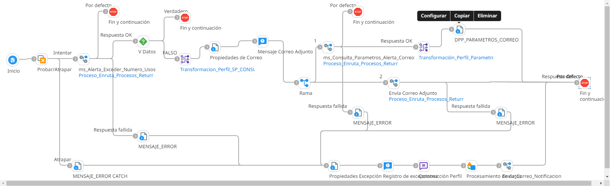

# ALERTA EXCEDE NUMERO USOS 

## job_Alerta_Excede_Numero_Usos

Frecuencia de ejecucion: Programado

### Sistemas involucrados: 
- SMTP
- Condor BD Oracle

### Descripcion general:
Proceso Job sincronico ejecutado. para el envio de un alerta por medio de correo electronico cuando se excede el numero de usos.  

El proceso inicia cuando un scheduler lanza el Job para alerta exceso de numero de usos. Para ello se ejecuta en Condor BD `Pendiente de revisar de produccion` y si se cumplen las validaciones iniciales, se ejecuta en condor BD `SP_GET_ALERTACORREO` y envia correo con dicha alerta

### Actividades del proceso: 
Subproceso principal: `ri_Alerta_Excede_Numero_Usos`

