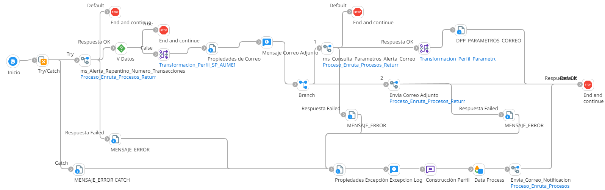

# ALERTA REPENTINO NUMERO DE USOS

## job_Alerta_Repentino_Numero_Transacciones

Frecuencia de ejecucion: Programado

### Sistemas involucrados: 

- Condor BD Oracle
- SMTP

### Descripcion general:
Proceso Job sincronico  ejecuta una alerta por usos repentetino de transacciónes de valor anormalmente alto.   

El proceso inicia cuando un scheduler lanza el Job para alerta clave invalida. Para ello se ejecuta en Condor BD `SP_AUMENTO_NUMERO_TRANS (SP)` y si se cumplen las validaciones iniciales, se ejecuta en condor BD `SP_GET_ALERTACORREO` y envia correo con dicha alerta

### Actividades del proceso: 
Subproceso principal: `ri_Alerta_Repentino_Numero_Transacciones`

