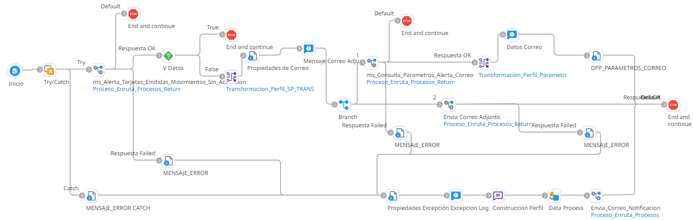

# ALERTA TARJETA EMITIDA MOVIMIENTOS SIN ACTIVACION

## job_Alerta_Tarjetas_Emitidas_Movimientos_Sin_Activacion

Frecuencia de ejecucion: Programado

### Sistemas involucrados: 

- Condor BD Oracle
- SMTP

### Descripcion general:
Proceso Job sincronico ejecutado para lanzar una alerta para tarjetas emitidas pero que no ha sido activada y tiene movimientos.   

El proceso inicia cuando un scheduler lanza el Job para alerta tarjeda emitida movimientos sin activacion. Para ello se ejecuta en Condor BD `SP_TRANS_TARJETAS_ANTESACTIV` y si se cumplen las validaciones iniciales, se ejecuta en condor BD `SP_GET_ALERTACORREO` y envia correo con dicha alerta

### Actividades del proceso: 

Subproceso principal:  `ri_Alerta_Tarjetas_Emitidas_Movimientos_Sin_Activacion` 

