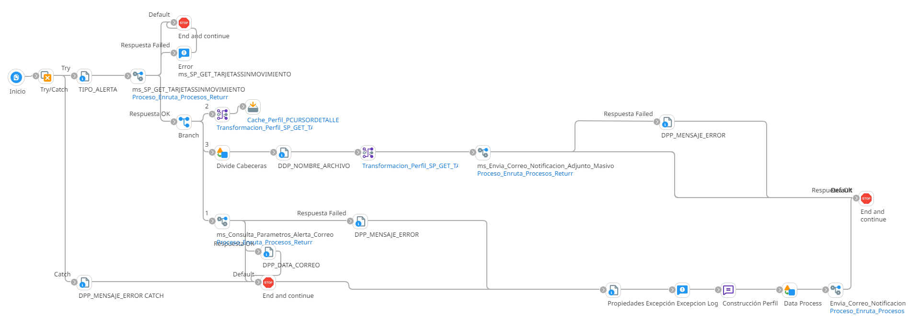

# ALERTA TARJETA SIN MOVIMIENTOS

## job_Alerta_Tarjeta_Sin_Movimientos

Frecuencia de ejecucion: Programado

### Sistemas involucrados: 

- Condor BD Oracle

### Descripcion general:
Proceso Job sincronico ejecutado ejecutar una alerta y se refiere a una tarjeta que no ha registrado ninguna transacción en un periodo determinado.   

El proceso inicia cuando un scheduler lanza el Job para alerta tarjeta sin movimientos. Para ello se ejecuta en Condor BD `SP_GET_TARPROXINACTIVAR (SP)` y si se cumplen las validaciones iniciales, se ejecuta en condor BD `SP_GET_ALERTACORREO` y envia correo con dicha alerta

### Actividades del proceso: 
Subproceso principal: `ri_Alerta_Tarjeta_Sin_Movimientos`

