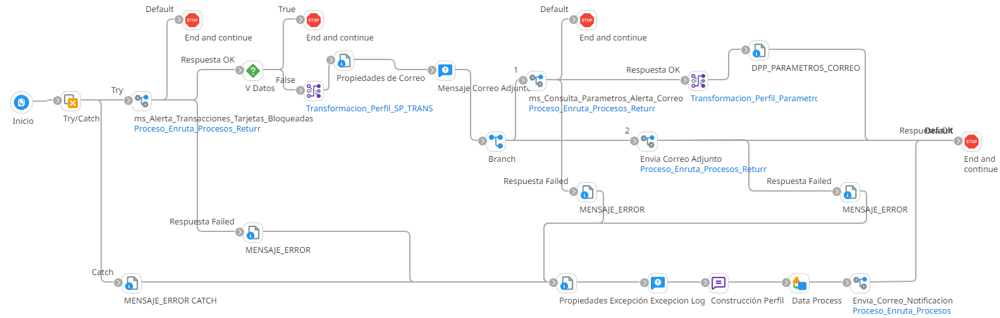

# ALERTA TRANSACCIONES TARJETA BLOQUEADA

## job_Alerta_Transacciones_Tarjetas_Bloqueadas

Frecuencia de ejecucion: Programado

### Sistemas involucrados: 

- Condor BD Oracle

### Descripcion general:
Proceso Job sincronico ejecutado ejecutar una alerta se refiere que se han intentado realizar operaciones con una tarjeta que ha sido bloqueada

El proceso inicia cuando un scheduler lanza el Job para alerta TRANSACCIONES TARJETA BLOQUEADA. Para ello se ejecuta en Condor BD `SP_TRANS_TARJETAS_BLOQ` y si se cumplen las validaciones iniciales, se ejecuta en condor BD `SP_GET_ALERTACORREO` y envia correo con dicha alerta

### Actividades del proceso: 
Subproceso principal: `ri_Alerta_Transacciones_Tarjetas_Bloqueadas`

