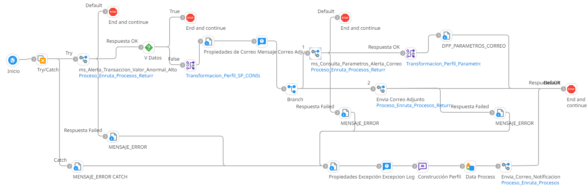

# ALERTA TRANSACCION VALOR ANORMAL ALTO

## job_Alerta_Transaccion_Valor_Anormal_Alto

Frecuencia de ejecucion: Programado

### Sistemas involucrados: 

- Condor BD Oracle

### Descripcion general:
Proceso Job sincronico ejecutado ejecutar una alerta por lo general indica que se ha detectado una transacción en tu cuenta que supera el monto habitual de tus operaciones.

El proceso inicia cuando un scheduler lanza el Job para alerta transaccion valor anormal alto. Para ello se ejecuta en Condor BD `SP_CONSUMO_VALOR_ALTO` y si se cumplen las validaciones iniciales, se ejecuta en condor BD `SP_GET_ALERTACORREO` y envia correo con dicha alerta

### Actividades del proceso: 
Subproceso principal: `ri_Alerta_Transaccion_Valor_Anormal_Alto`

