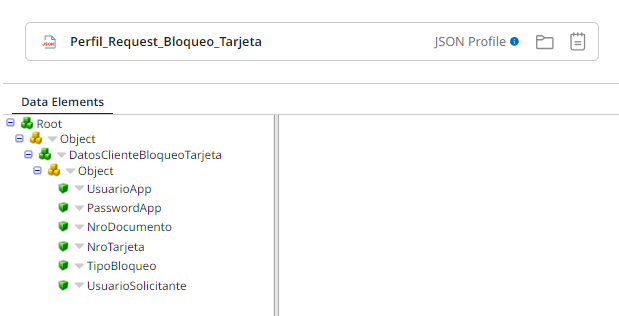

# Bloqueo de tarjeta

## Web service (ws_bloqueo_Tarjeta)
1. El webservice recibe el siguiente perfil XML. <!-- Preguntar a Pluxee cual de estos WS (XML o REST) es el usado -->


1. El webservice recibe el siguiente perfil JSON.



2. Establece las siguientes propiedades.
    - OPERACION: `bloqueoTarjeta`

3. El perfil XML debe ser validado, tiene las siguientes validaciones.
<!-- Documentar las validaciones que tiene le perfil XML -->

4. En caso de que la validación falle, tenemos los siguientes casos de respuesta.

    1. La validación falló
    ```xml
        <RESPUESTA_BLOQUEOTARJETA>
            <PSALIDA>0</PSALIDA>
            <DESCRIPCION>Datos de entrada no validos: Detalle de error: {1}
            </DESCRIPCION>
            <CODIGOHTTP>403</CODIGOHTTP>
        </RESPUESTA_BLOQUEOTARJETA>
    ```
    Donde `{1}` es el mensaje de validación.

        
    2. Ocurrió un error durante el proceso del WS
    ```xml
        <RESPUESTA_BLOQUEOTARJETA>
            <PSALIDA>0</PSALIDA>
            <DESCRIPCION>{1}
            </DESCRIPCION>
            <CODIGOHTTP>403</CODIGOHTTP>
        </RESPUESTA_BLOQUEOTARJETA>
    ```
    Donde `{1}` es el mensaje del try catch
    
    
    3. Ocurrió un error durante la regla de integración (default), este escenario no aplica en caso de aplicar colas en Azure.
    ```xml
        <RESPUESTA_BLOQUEOTARJETA>
            <PSALIDA>0</PSALIDA>
            <DESCRIPCION>Operación no valida
            </DESCRIPCION>
            <CODIGOHTTP>403</CODIGOHTTP>
        </RESPUESTA_BLOQUEOTARJETA>
    ```
5. Retornar la respuesta positiva si se hizo el proceso correctamente, retornar la respuesta fallida en cualquiera de los casos anteriores.

## Regla de integración (ri_Bloqueo_Tarjeta)

1. Establece las siguientes propiedades, el perfil en este punto es `(Perfil_Request_Bloqueo_Tarjeta_Refresh)`.
    - GENERA_EXCEPCION: `0`
    - IDENTITY: `Es un valor único probablemente autogenerado.` <!-- Confirmar la naturaleza del dato -->
    - P_USUARIO: `UsuarioApp (DatosClienteBloqueoTarjeta/UsuarioApp)`
    - NRODOCUMENTO: `NroDocumento (DatosClienteBloqueoTarjeta/NroDocumento)`
    - TIPOBLOQUEO: `TipoBloqueo (DatosClienteBloqueoTarjeta/TipoBloqueo)`
    - CONTINUA_FLUJO: `0`
    - P_USUARIO_SOLICITA: `UsuarioSolicitante (DatosClienteBloqueoTarjeta/UsuarioSolicitante)`
    - OPERACION_SECUNDARIA: `consultaEstadoTarjeta`

2. A partir de este punto se establece un try catch, continuar en la sección para ver el flujo del catch.

3. Realiza el mapeo `Transformacion_Request_a_Perfil_Validacion`, en este mapeo se guarda la *dynamic property* `USUARIOAPP` con el valor de la propiedad del perfil de entrada `UsuarioApp`

4. Se inicia el proceso de validación de permisos (enlace hacia el MD)

5. Habra dos posibles resultados, el proceso de validación saldrá OK o fallará, ir a la sección ([Flujo fallido validación de permisos](#validacion-permisos-fallida).) para el flujo fallido.

6. Se establece la propiedad, el perfil en este punto es `Perfil_Response_Datos_Validacion`
    - NOMBRE_AUTORIZADOR: `NOMBREAUTORIZADOR (root/RESPUESTADATOSVALIDACION/NOMBREAUTORIZADOR)`

7. Si la *dynamic property* `INTENTO` no es igual a `1` continuar al paso 8. De lo contrario continuar al paso 9.

8. Establece la *dynamic property* `INTENTO` en `1`

9. Se inicia el proceso de inserción de solicitud de bloqueo.

10. Si el proceso es exitoso, establecer las propiedades, el perfil en este punto es `Perfil_Response_Inserta_Solicitud_Tarjeta`:
    - CONTINUA_FLUJO: `1`
    - P_IDSOLICITUDBLOQUEO: `P_IDSOLICITUDBLOQUEO (RESPUESTA_INSERTA_SOLICITUD_BLOQUEO/P_IDSOLICITUDBLOQUEO)`

11. Si el proceso falló, establecer la propiedad, el perfil en este punto es `Perfil_Response_Valida_Bloqueo_Tarjeta_Condor`
    - MENSAJE_ERROR: `P_TEXTO (RESPUESTA_VALIDA_BLOQUEO_TARJETA_CONDOR/P_TEXTO)`

12. Si la propiedad `CONTINUA_FLUJO` es igual a `1` continua al paso 13, de lo contrario ir al proceso de registro de log [Registro de logs](#logs)

13. Inicia el proceso ejecutar autorizador (Enlace al MD)

14. En este proceso, el servicio puede estar no implementado dependiendo del AUTORIZADOR, en este caso se deberá responder con.
    ```xml
    <RESPUESTA_BLOQUEOTARJETA>
        <psalida>0</psalida>
        <descripcion>Servicio no Implementado</descripcion>
        <codigohttp>403</codigohttp>
    </RESPUESTA_BLOQUEOTARJETA>
    ```
    Si responde con error deberá ir [Autorizador flujo failed](#autorizador-flujo-failed)
15. En el caso de que el proceso responda satisfactoriamente se establece la propiedad `P_ESTADO` en `2` y `P_CODIGORESPUESTA` en `rc (ResponseNovopaymentBloqueoTarjeta/rc)`, el perfil en este punto es `Perfil_Response_HTTP_Novopayment_Bloqueo_Tarjeta`

16. Inicia el proceso "actualiza solicitud bloqueo" (*Actualiza_Solicitud_bloqueo*)

17. Si el servicio responde con un error se establece la propiedad `MENSAJE_ERROR` con el siguiente template `{{MENSAJE_ERROR}} + "-" + "Actualiza_Solicitud_Bloqueo:" + {{P_TEXTO (RESPUESTA_PROCEDIMIENTO_ALMACENADO/P_TEXTO)}}`, el perfil en este punto es `XML Profile - Perfil_Response_Procedimiento Almacenado`

18. Inicia el proceso "Actualiza_Estado_Bloqueo_Condor" (Enlace al MD)

19. Si el proceso responde con un error, establece la propiedad  `MENSAJE_ERROR` con el siguiente template `{{MENSAJE_ERROR}} + "-" + "Actualiza_Estado_Bloqueo_Condor:" + {{P_TEXTO (RESPUESTA_VALIDA_BLOQUEO_TARJETA_CONDOR/P_TEXTO))}}`, el perfil en este punto es `Perfil_Response_Valida_Bloqueo_Tarjeta_Condor`

20. Se transforma el perfil con un message shape en caso de exito.
    ```xml
    <RESPUESTA_BLOQUEOTARJETA>
        <PSALIDA>1</PSALIDA>
        <DESCRIPCION>Operación realizada con éxito</DESCRIPCION>
        <CODIGOHTTP>200</CODIGOHTTP>
    </RESPUESTA_BLOQUEOTARJETA>
    ```

21. Si la dynamic property `P_ADMITEREEXPEDICION` es igual a `1` continua al paso 22. caso contrario, continua al paso 24.

22. Aplica la transformación `Transformacion_Perfil_Reexpide_Tarjeta`

23. Se envía a la cola con la operación `Operacion_Enviar_Reexpedicion_Tarjeta`

### Flujo fallido validación de permisos {#validacion-permisos-fallida}

1.  Transforma el perfil con un message shape a:
    ```xml
    <RESPUESTA_BLOQUEOTARJETA>
        <PSALIDA>0</PSALIDA>
        <DESCRIPCION>{1}</DESCRIPCION>
        <CODIGOHTTP>403</CODIGOHTTP>
    </RESPUESTA_BLOQUEOTARJETA>
    ```
    Donde:
    - `{1}`: `ERROR (root/RESPUESTADATOSVALIDACION/ERROR)`
    El perfil en este punto es `XML Profile - Perfil_Response_Datos_Validacion`

2. Ir al proceso de registro de log [Registro de logs](#logs)

### Autorizador flujo failed

1. Se valida que `ResponseNovopaymentBloqueoTarjeta/rc` sea igual a `999`

2. Si no se cumple la validación ir al paso 6.

3. Si se cumple la validación se inicia el proceso Consulta Estado, este proceso puede arrojar 3 posibles respuestas.
    - Respuesta 1
    - Respuesta 2
    - Respuesta 3

4. En caso de la respuesta 1 continuamos en el paso 13. de la regla de integración.

5. En caso de la respuesta 2 continuamos en el paso 15. de la regla de integración.

6. En caso de la respuesta 3 establecemos las siguientes propiedades
    - MENSAJE_ERROR: `{{MENSAJE_ERROR}} + "-" + {{msg (ResponseNovopaymentBloqueoTarjeta/msg)}}`
    - P_ESTADO: `3`
    - CODIGORESPUESTA: `rc (ResponseNovopaymentBloqueoTarjeta/rc)` 
    El perfil en este punto es `Perfil_Response_HTTP_Novopayment_Bloqueo_Tarjeta`

7. Inicia el proceso Actualiza_Solicitud_Bloqueo.

8. En caso de respuesta fallida del proceso establecer la propiedad
    - MENSAJE_ERROR: `{{MENSAJE_ERROR}} + "-" + "Actualiza_Solicitud_Bloqueo:" + {{P_TEXTO (RESPUESTA_PROCEDIMIENTO_ALMACENADO/P_TEXTO)}}` 
    El perfil en este punto es `XML Profile - Perfil_Response_Procedimiento Almacenado`

9. Se transforma con un message shape el perfil a:
    ```xml
        <RESPUESTA_BLOQUEOTARJETA>
            <PSALIDA>0</PSALIDA>
            <DESCRIPCION>Error_NovoPayment:{1}:{2}-Errores adicionales:{3}</DESCRIPCION>
            <CODIGOHTTP>400</CODIGOHTTP>
        </RESPUESTA_BLOQUEOTARJETA>
    ```
    Donde:
    - `{1}`: `rc (ResponseNovopaymentBloqueoTarjeta/rc)`
    - `{2}`: `msg (ResponseNovopaymentBloqueoTarjeta/msg)`
    - `{3}`: `MENSAJE_ERROR`
    El perfil en este punto es `XML Profile - Perfil_Response_HTTP_Novopayment_Bloqueo_Tarjeta`

10. Ir al proceso de registro de log [Registro de logs](#logs)

### Try catch regla de integración. {#try-catch}

1. Aplica la transformación `Transformacion_Request_Response_Bloqueo_Tarjeta`

2. Si la propiedad `RETURN_OK` es igual a `1`

3. Si la condición se cumple, flujo A, si no flujo B

    3.A.1. Si la propiedad `P_ADMITEREEXPEDICION` es igual a `1` continuar al paso 3.A.2 si no ...

    3.A.2. Aplica la transformación `Transformacion_Perfil_Reexpide_Tarjeta`

    3.A.3. Inicia proceso inicia proceso de reexpedición.

    3.B.1. Establece la propiedad 

### Registro de logs {#logs}

En construcción...