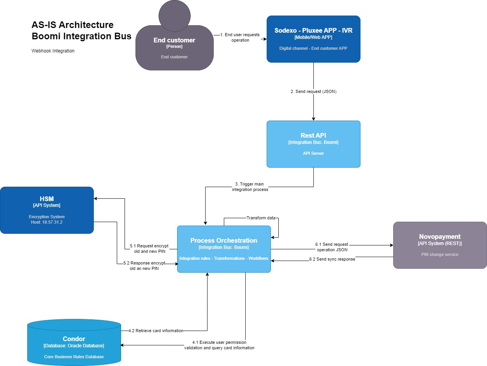
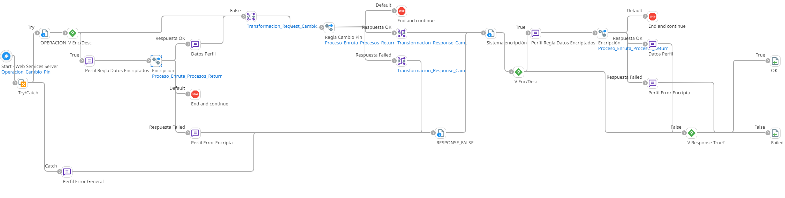
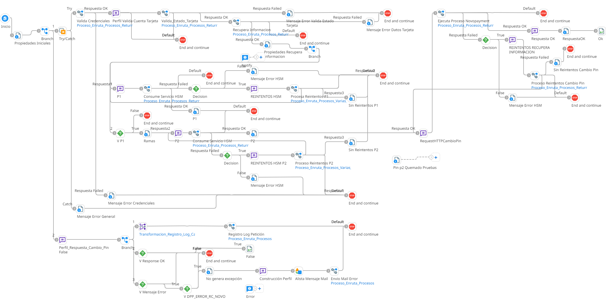

# Cambio de PIN

## ws_Cambio_Pin
Frecuencia de ejecución: Segun demanda del usuario.

### Sistemas involucrados: 

- Boomi Webhook
- Web Service HSM
- Novopayment
- Condor BD Oracle

### Descripción general

La integración se dispara segun demanda del usuario a traves de un Web Service, enviando los datos del usuario y la información del PIN actual y el PIN nuevo, se realiza un proceso de encriptación de la información segun si está habilitada un registro en una CRT (Cross Reference Table), y se envía a la regla de integración que valida los permisos del usuario, el estado de la tarjeta, recupera la información de la tarjeta en **Condor** y con esta información consume el servicio web **HSM** para ambos PIN el actual y el nuevo. Luego de esto se consume el servicio de **Novopayment** para el cambio de PIN y se da una respuesta al usuario.

### Actividades del proceso

Webhook: `ws_Cambio_Pin`

Se encarga de recibir la petición del usuario, encriptar información y enrutar al subproceso principal.

Subproceso principal: `ri_Cambio_Pin`

Realiza las validaciones correspondientes en **Condor**, obtiene la información necesaria, consume el web service **HSM** y ejecuta la actualización en **Novopayment**