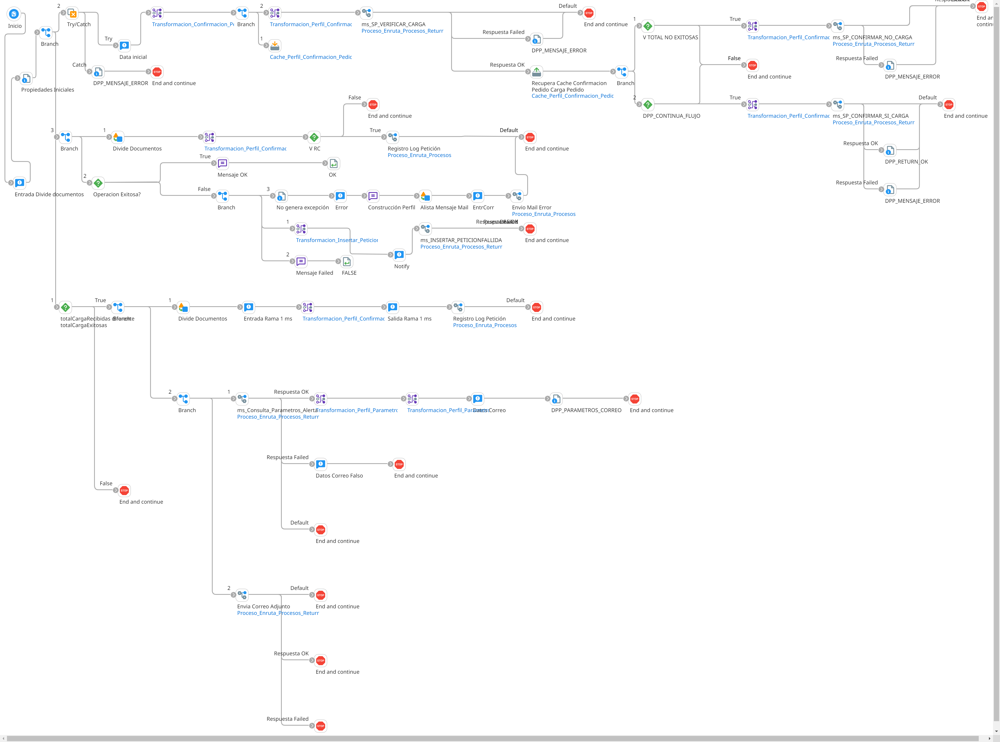

# Confirmación Carga Tarjeta

## ws_confirmacion_pedido_carga

Frecuencia de ejecucion: a demanda 

### Sistemas involucrados: 

 - Novopayment 
 - Boomi Application Server (Web service): [APPSERVER_IP]:[PORT]/ws/simple/executeConfirmarPedidoCarga
- Condor DB Oracle


### Descripcion general:
Despues de enviar la carga programada de tarjetas al autorizador Novopayment, este ultimo procesa la solicitud y en un flujo asincrónico llama un Web service de Pluxee llamado `executeConfirmarPedidoCarga` con el objetivo de confirmar los pedidos de carga previamente enviados. 
La estructura de entrada del mensaje de confirmacion incluye el producto y los pedidos asociados con los valores totales de carga exitosa y no exitosa. Para los pedidos con cargas no exitosas, se incluye un detalle de las cuentas fallidas en la carga en un arreglo de datos.
Con esta informacion y las transformaciones necesarias, se ejecuta en  Condor BD `SP_VERIFICAR_CARGA`. 

Si existen carga no exitosas, se ejecuta en Condor BD `SP_CONFIRMAR_NO_CARGA`.

Luego se ejecuta `SP_CONFIRMAR_SI_CARGA`.

En caso de errores en el proceso se ejecuta en Condor `PKG_WSSERVICIO.SP_INSERTAR_PETICIONFALLIDA`    


### Variables globales:
- DPP_CODPRODUCTO
- DPP_OPERACION
- DPP_FECHACONFIRMACION
- OPERACION
- DPP_TRXID
- DPP_ID_PEDIDO
- DPP_CONTINUA_FLUJO

### Actividades del proceso: 
Subproceso principal: `ri_Confirmacion_Pedido_Carga`



1. Se invoca el web service `executeConfirmarPedidoCarga` a traves de la operacion `Operacion_ConfirmarPedidoCarga` (Objeto ConfirmarPedidoCarga). 

    Perfil request: JSON, `Perfil_Request_Confirmacion_Pedido_Carga` que incluye un objeto principal con el codProducto y fechaTransaccion. Dentro de este se incluye un array ListaPedido que incluye: idPedido, trxId, creditType, totalCargaRecibidas, totalCargaExitosas, totalCargaNoExitosas y listaCargaNoExitosas (objeto array)

    Perfil response: JSON, `Perfil_Response_Confirmacion_Embozado_Tarjetas_Confirmacion_Pedido_Carga` que incluye CodigoError, pSalida y Descripcion

2. Se cambia a formato XML el mensaje de request con el mapeo `Transformacion_Perfil_Request_Confirmacion_Pedido_Carga`

3. Se llama el subproceso `ri_Confirmacion_Pedido_Carga`, se definen las propiedades o variables iniciales.

    Si el campo `totalCargaRecibidas` es diferente al campo `totalCargaExitosas` en el XML de entrada, se construye mensaje de notificacion por correo electronico y se registra logs.
    
    Luego, en todos los casos se corre el mapeo `Transformacion_Confirmacion_Pedido_Carga_Pedidos`: Perfil `Perfil_Confirmacion_Pedido_Carga_Pedido` y se guarda cache.
    Se corre el mapeo `Transformacion_Perfil_Confirmacion_Pedido_Carga_Pedido_to_Perfil_Parametros_Entrada_Generico_Salida` a mensaje generico XML para Condor: perfil `Perfil_Parametros_Entrada_Generico_Salida`.
    
    A continuacion, se llama al subproceso `ms_sp_verificar_carga` con mapeo `Transformacion_Perfil_Parametros_Entrada_Generico_Salida_to_Perfil_Parametros_Entrada_Generico_Salida_CONFIRMACION_PEDIDO_CARGA` agregando ID_RECORD en el mensaje XML con una funcion de concatenacion entre ID_RECORD y ID_EJECUCION (FUNCION: `Funcion_Llave_Documento`). Para obtener ID_EJECUCION se corre el siguiente script:

        import com.boomi.execution.ExecutionUtil;
        ID_EJECUCION = ExecutionUtil.getRuntimeExecutionProperty ("EXECUTION_ID");
        ID_EJECUCION = ID_EJECUCION.substring(10,ID_EJECUCION.length()-11); 
    
    Se invoca la operacion de BD Condor: Operacion_SP_VERIFICAR_CARGA con un llamado al `SP_VERIFICAR_CARGA`.
    Mapeo `Transformacion_Perfil_SP_VERIFICAR_CARGA_to_Perfil_Parametros_Entrada_Generico_Salida`: `Perfil_Parametros_Entrada_Generico_Salida`

    Si total cargas no exitosas NO es cero (hay cargas con errores): Mapeo `Transformacion_Perfil_Confirmacion_Pedido_Carga_Pedido_to_Perfil_Parametros_Entrada_Generico_Salida_ms_SP_CONFIRMAR_NO_CARGA`: `Perfil_Parametros_Entrada_Generico_Salida`. Se corre el subproceso `ms_sp_confirmar_no_carga` que invoca la operacion de BD Condor: Operacion_SP_CONFIRMAR_NO_CARGA con un llamado al `SP_CONFIRMAR_NO_CARGA`.

    <!-- Indagar donde se establece la variable DPP_CONTINUA_FLUJO -->

    Si `DPP_CONTINUA_FLUJO` = 1 -> Mapeo `Transformacion_Perfil_Confirmacion_Pedido_Carga_Pedido_to_Perfil_Parametros_Entrada_Generico_Salida_ms_SP_CONFIRMAR_SI_CARGA`: `Perfil_Parametros_Entrada_Generico_Salida`. Se corre el subproceso `ms_sp_confirmar_si_carga` que invoca la operacion de BD Condor: Operacion_SP_CONFIRMAR_SI_CARGA con un llamado al `SP_CONFIRMAR_SI_CARGA`.

    Registrar logs.

    Si todo funciona correctamente, se construye un mensaje:
    ```xml
        <PARAMETROS_SP_GENERICO>
            <PARAMETRO1>0</PARAMETRO1>
            <PARAMETRO2>200 - OK</PARAMETRO2>
            <PARAMETRO3>200</PARAMETRO3>
        </PARAMETROS_SP_GENERICO>
    ```
    En caso de error, enviar correo electronico de notificacion de error,
    Mapeo 
    `Transformacion_Insertar_Peticion_Fallida_Confirmacion_Pedido_Carga`: `Perfil_Parametros_Entrada_Generico_Salida` y llamar al subproceso: ms_INSERTAR_PETICIONFALLIDA que invoca en BD Condor `PKG_WSSERVICIO.SP_INSERTAR_PETICIONFALLIDA`
     
    Armar XML con variable DPP_MENSAJE_ERROR:
    ```xml
    # {1} DPP_MENSAJE_ERROR
    <PARAMETROS_SP_GENERICO>
        <PARAMETRO1>1</PARAMETRO1>
        <PARAMETRO2>400 - {1}</PARAMETRO2>
        <PARAMETRO3>400</PARAMETRO3>
    </PARAMETROS_SP_GENERICO>
    ```
    


       
