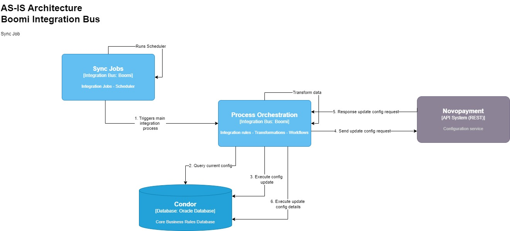
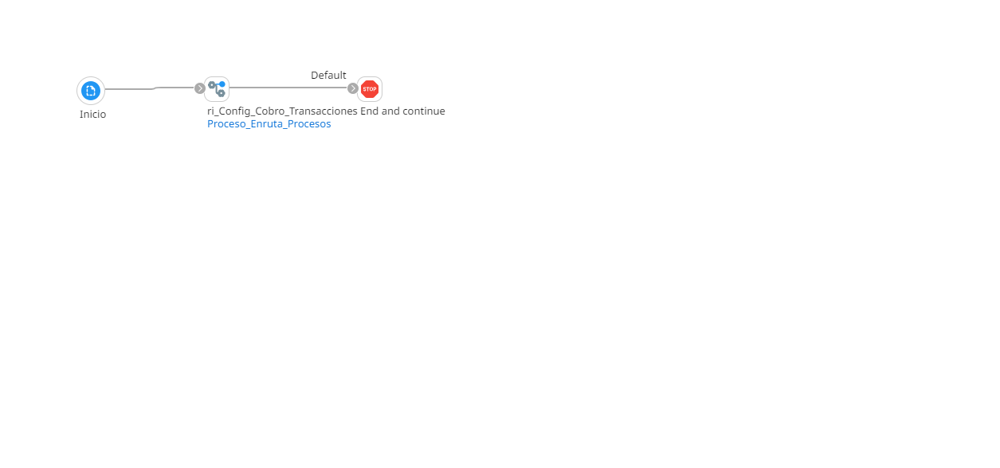
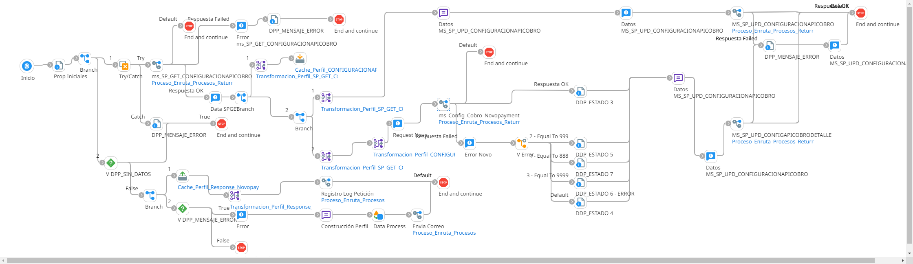

# Configuración API Cobro

## job_Configuracion_API_Cobro

Frecuencia de ejecución: Segun scheduler

### Sistemas involucrados: 

- Boomi Job
- Novopayment
- Condor BD Oracle

### Descripción general

La regla de integración consulta la base de datos **Condor** para consultar la configuración actual del API, luego ejecuta un proceso de actualización de los datos de configuración en la misma base de datos. Posteriormente se envía la solicitud de actualización de la configuración a **Novopayment** y segun la respuesta de este, se vuelve a ejecutar un proceso de actualización esta vez para el detalle de la configuración en **Condor**.

### Actividades del proceso

Job: `job_Configuracion_API_Cobro`

Subproceso principal (RI): `ri_Config_Cobro_Transacciones`

