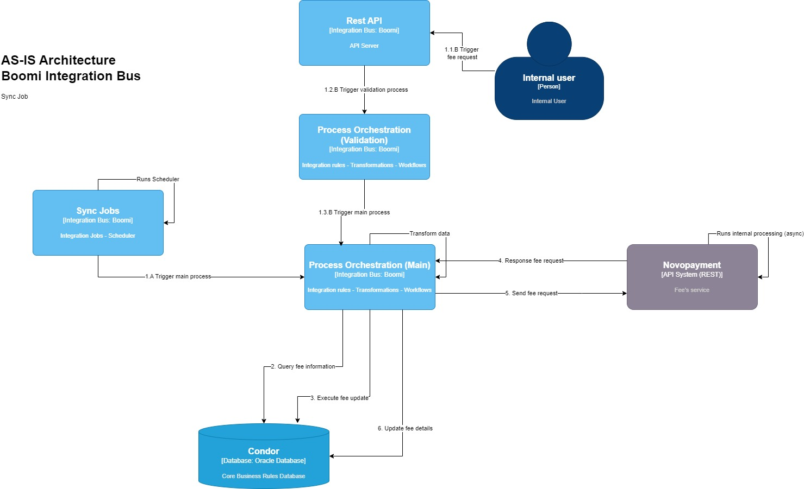
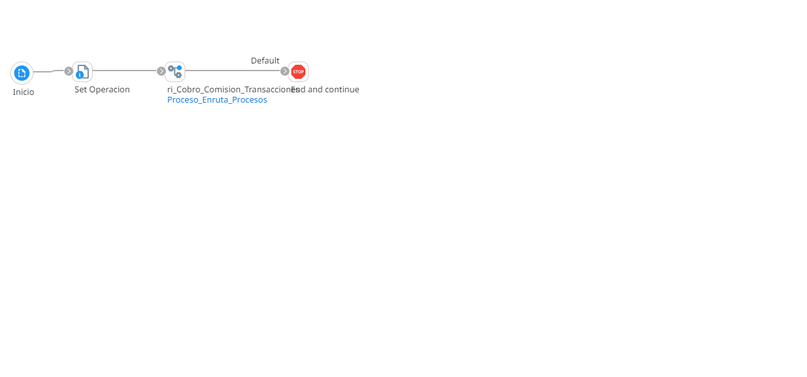
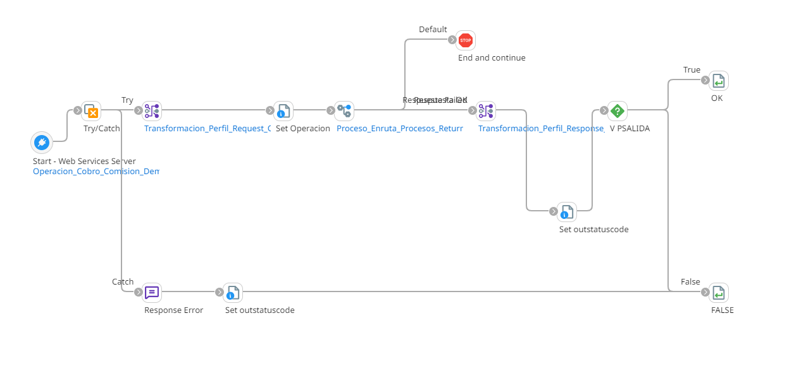
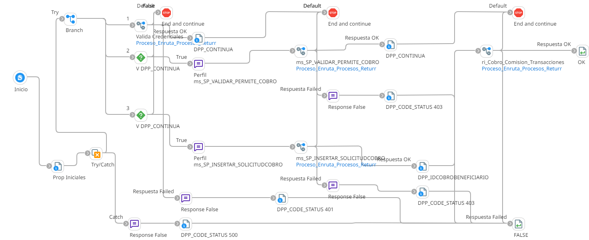
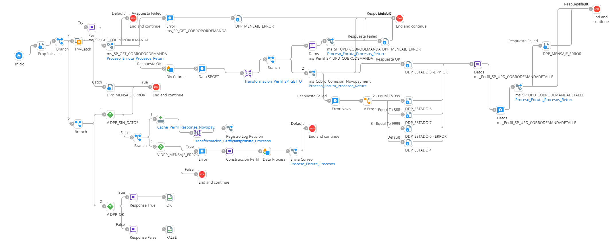

# Configuración API Cobro

## job_Configuracion_Cobro_Por_Demanda

Frecuencia de ejecución: Segun scheduler

## ws_Configuracion_Cobro_Por_Demanda

Frecuencia de ejecución: Segun demanda del usuario

### Sistemas involucrados: 

- Boomi Job
- Boomi Web Service
- Novopayment
- Condor BD Oracle

### Descripción general

Dependiendo de si es el job quien ejecuta la integración, o es activada mediante el web service bajo demanda. Se valida que el usuario esté correctamente autenticado y autorizado para realizar cobro por demanda, esto en la base de datos **Condor** que contiene dicha información, en el caso de ser activada mediante el web service. Al ser activada por el job, se salta el subproceso de validación y pasa directamente a la regla de integración que contiene la lógica para efectuar el cobro por demanda.
En esta regla de integración principal se consulta en **Condor** los datos del cobro por demanda para el usuario indicado, y se ejecuta un proceso de actualización de esta información. Una vez obtenida la información y realizada la actualización, se manda una solicitud a **Novopayment** para efectuar el cobro. Cuando **Novopayment** responde con el detalle de la operación, se actualiza el detalle del cobro en **Condor**

### Actividades del proceso

Job: `job_Configuracion_Cobro_Por_Demanda`

Web Service: `ws_Configuracion_Cobro_Por_Demanda`

Subproceso de validación (RI): `ri_Cobro_Comision_Demanda_Validaciones`

Subproceso principal (RI): `ri_Cobro_Comision_Transacciones`

