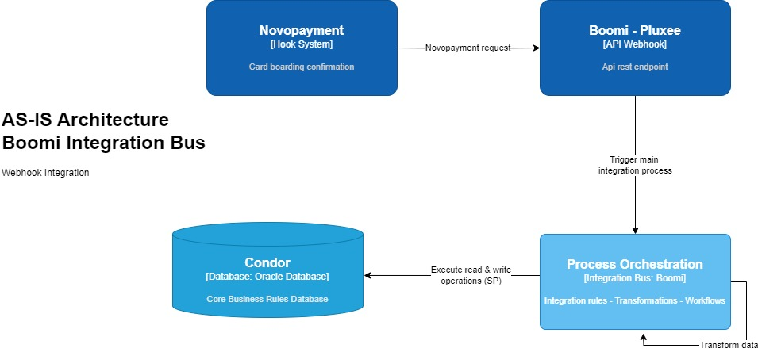
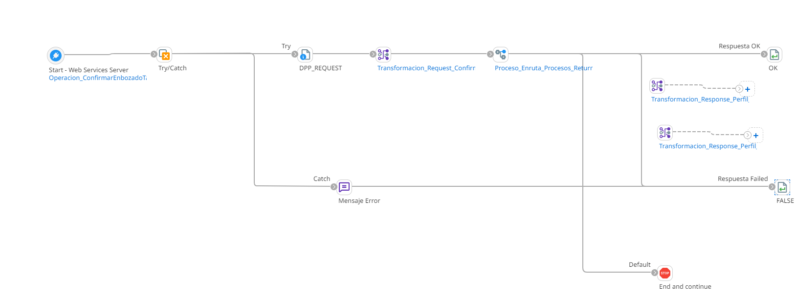
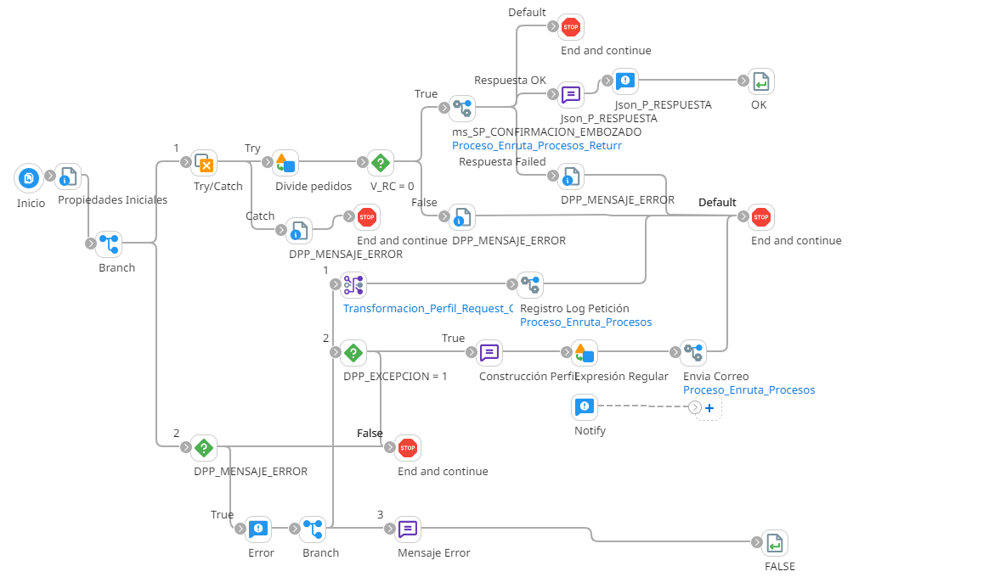

# Confirmación embozado de tarjetas

## ws_Confirmacion_Embozado_Tarjetas

Frecuencia de ejecucion: Hook disponible para el consumo por parte de Novopayment al confirmar embozados de tarjeta.

### Sistemas involucrados: 

- Boomi Webhook
- Novopayment
- Condor BD Oracle

### Descripción general

Webhook disponible para la recepción de confirmación de embozado de tarjeta. Esta integración se ejecuta iniciada por una solicitud (confirmación) de **Novopayment**, confirmando las tarjetas enviadas para producir (embozar). 

### Actividades del proceso

Webhook: `ws_Confirmacion_Embozado_Tarjetas`

El weebhook o web service se encarga de recibir la solicitud proviniente de Novopayment y enrutar a la regla de integración, respondiendo con un mensaje de error en caso de que ocurra alguna excepción durante el resto del proceso.

Subproceso principal (RI): `ri_Confirmacion_Embozado_Tarjetas`

Desde Novopayment se envia la información de la lista de pedidos con la cantidad de tarjetas fabricadas, el número del pedido, rc y otros datos.
Por cada uno de los elementos del arreglo de lista de pedidos, ya que son múltiples por request, los que vienen en esta lista, se envía la solicitud a **Condor** para la actualización de los registros correspondientes.