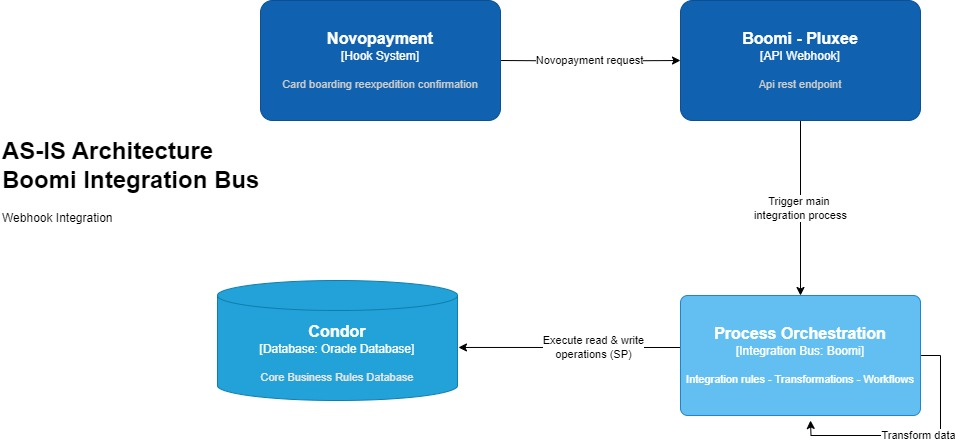
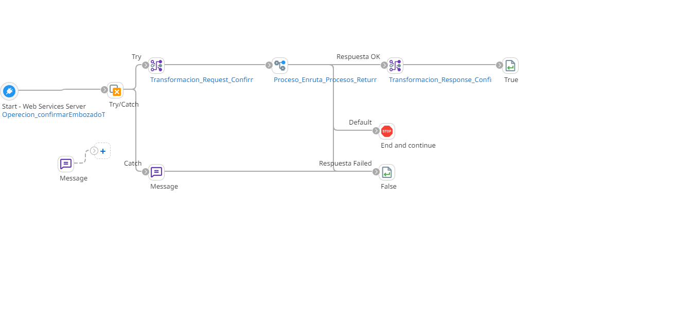
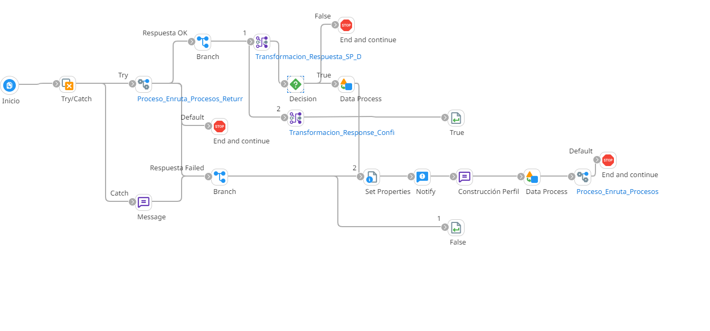

# Confirmación embozado de tarjetas reexpedición

## ws_ConfirmarEmbozadoTarjetasReexpedidas

Frecuencia de ejecucion: Hook disponible para el consumo por parte de Novopayment al confirmar embozado de tarjetas reexpedidas.

### Sistemas involucrados: 

- Boomi Webhook
- Novopayment
- Condor BD Oracle

### Descripción general

Webhook disponible para la recepción de confirmación de embozado de tarjetas reexpedidas. Esta integración se ejecuta iniciada por una solicitud (confirmación) de **Novopayment**, confirmando las tarjetas reexpedidas enviadas para embozar. 

### Actividades del proceso

Webhook: `ws_ConfirmarEmbozadoTarjetasReexpedidas`

El weebhook o web service se encarga de recibir la solicitud proviniente de Novopayment y enrutar a la regla de integración, respondiendo con un mensaje de error en caso de que ocurra alguna excepción durante el resto del proceso.

Subproceso principal (RI): `ri_Confirmacion_Embozado`

Desde Novopayment se envia la información de la lista de reexpediciones.
La lista de reexpediciones se envia como parametro a la base de datos de **Condor** para ejecutar el SP correspondiente y dar una respuesta al la solicitud de confirmación en base a la respuesta del SP.