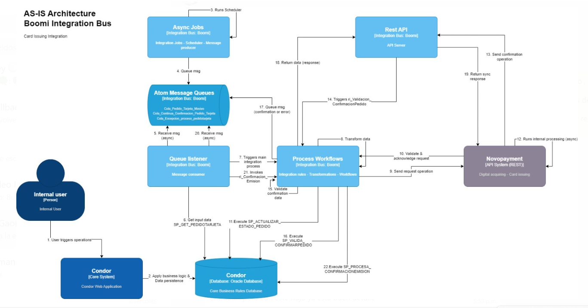
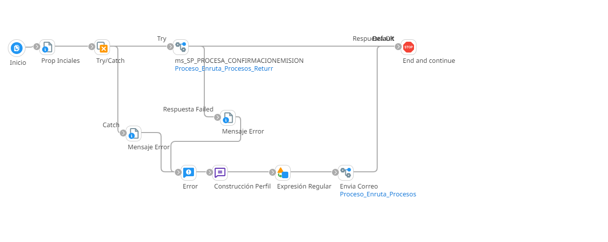
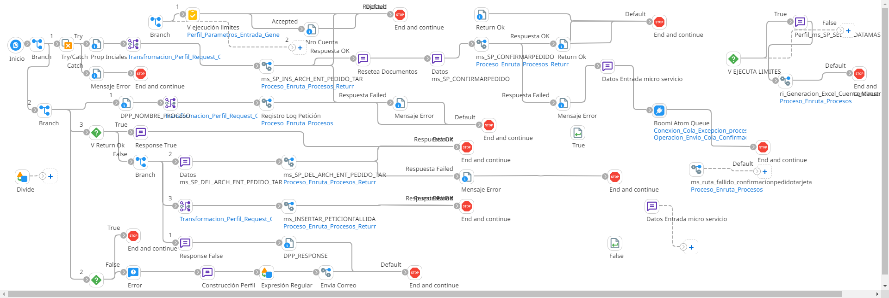
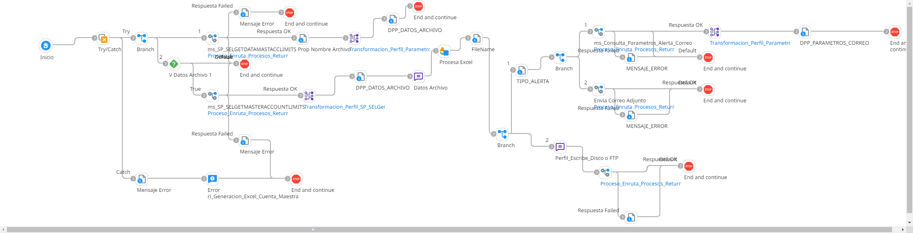
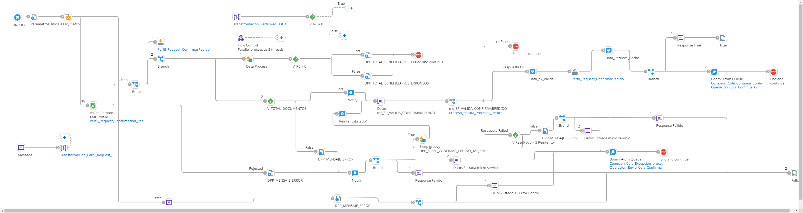

# CONFIRMACION_PEDIDO_TARJETA

1. **Interfaces**
    1. **queque_Confirmacion_Pedido_Tarjeta**
        Inicia el proceso con la escucha de mensajes de la cola ``Cola_Continua_Confirmacion_Pedido_Tarjeta`` y ejecuta el proceso ``ri_Confirmacion_Emision``.
    2. **ws_Confirmacion_Pedido_Tarjeta**
        1. Inicia el proceso con la escucha de un Web Service con la url ``/ws/simple/executeConfirmacionPedidoTarjeta`` y el objeto ``confirmacionPedidoTarjeta`` y nos retorna un JSON.
        2. Luego pasa por un mapeo de datos y se convierte en XML.
        3. Luego ejecuta el proceso ``ri_Validacion_ConfirmacionPedido`` y lo que retorna es nuevamente convertido a JSON.
        4. Dependiendo de la respuesta, retorna un OK o un FALSE.
2. **Microservicios**
    1. **ms_SP_CONFIRMARPEDIDO**
        1. Inicia con el mapeo de XML a XML, luego se conecta a a BD de Condor y ejecuta el sp: ``CONDOR.PKG_ARCHIVOSENTRADA.SP_CONFIRMARPEDIDO``
        2. Lo que retorna es convertido a XML y dependiendo de la respuesta ``PARAMETRO3``, retorna un OK o un FALSE.
    2. **ms_SP_DEL_ARCH_ENT_PEDIDO_TAR**
        1. Inicia con el mapeo de XML a XML, luego se conecta a a BD de Condor y ejecuta el sp: ``CONDOR.PKG_ARCHIVOSENTRADA.SP_DEL_ARCH_ENT_PEDIDO_TAR``.
        2. Lo que retorna es convertido a XML y dependiendo de la respuesta ``PARAMETRO3``, retorna un OK o un FALSE.
    3. **ms_SP_INS_ARCH_ENT_PEDIDO_TAR**
         1. Inicia con el mapeo de XML a XML, luego se conecta a a BD de Condor y ejecuta el sp: ``CONDOR.PKG_ARCHIVOSENTRADA.SP_INS_ARCH_ENT_PEDIDO_TAR``.
        2. Lo que retorna es convertido a XML y dependiendo de la respuesta ``PARAMETRO3``, retorna un OK o un FALSE.
    4. **ms_SP_PROCESA_CONFIRMACIONEMISION**
         1. Inicia con el mapeo de XML a XML, luego se conecta a a BD de Condor y ejecuta el sp: ``CONDOR.PKG_ARCHIVOSENTRADA.SP_PROCESA_CONFIRMACIONEMISION``.
        2. Lo que retorna es convertido a XML y dependiendo de la respuesta ``PARAMETRO3``, retorna un OK o un FALSE.
    5. **ms_SP_SELGETDATAMASTACCLIMITS_NOPRD**
         1. Inicia con el mapeo de XML a XML, luego se conecta a a BD de Condor y ejecuta el sp: ``CONDOR.PKG_CUENTAMAESTRA.SP_SELGETDATAMASTACCLIMITS``.
        2. Lo que retorna es convertido a XML y dependiendo de la respuesta ``PARAMETRO3``, retorna un OK o un FALSE.
    6. **ms_SP_SELGETMASTERACCOUNTLIMITS_NOPRD**
         1. Inicia con el mapeo de XML a XML, luego se conecta a a BD de Condor y ejecuta el sp: ``CONDOR.PKG_CUENTAMAESTRA.SP_SELGETMASTERACCOUNTLIMITS``.
        2. Lo que retorna es convertido a XML y dependiendo de la respuesta ``PARAMETRO3``, retorna un OK o un FALSE.
    7. **ms_SP_VALIDA_CONFIRMARPEDIDO**
         1. Inicia con el mapeo de XML a XML, luego se conecta a a BD de Condor y ejecuta el sp: ``CONDOR.PKG_ARCHIVOSENTRADA.SP_VALIDA_CONFIRMARPEDIDO``.
        2. Lo que retorna es convertido a XML y dependiendo de la respuesta ``PARAMETRO3``, retorna un OK o un FALSE.
3. **Reglas de Integración**
    1. **ri_Confirmacion_Emision**
        
        1. Ejecuta el proceso ``ms_SP_PROCESA_CONFIRMACIONEMISION``, si se ejecuta correctamente termina el proceso.
        2. Si falla, crea un mensaje de error y ejecuta el proceso ``Envia_Correo_Notificacion``.
    2. **ri_Confirmacion_Pedido_Tarjeta**
        
        1. Primero entra en un mapeo de XML a XML, luego ejecuta el proceso ``ms_SP_INS_ARCH_ENT_PEDIDO_TAR``
            1. Si se ejecuta correctamente, arma unos mensajes y ejecuta el proceso ``ms_SP_CONFIRMARPEDIDO`` 
                - Si se ejecuta correctamente, retorna un OK.
                - Si falla, envia un mensaje a la cola ``Cola_Excepcion_proceso_pedidotarjeta``.
            2. Si falla, retorna al siguiente paso.
        2. Entra en un mapeo de XML a XML y ejecuta el proceso ``ms_Registro_Log`` y continua con el siguiente paso.
        3. Arma un mensaje y ejecuta el proceso ``Envia_Correo_Notificacion``.
        4. Entra en una validacion del parametro ``DPP_RETURN_OK`` es igual a ``1``.
            1. Si es correcto, Arma un mensaje y termina este paso.
            2. Si falla, pasa por un mapeo de XML a XML y ejecuta el proceso ``ms_INSERTAR_PETICIONFALLIDA``.
            3. Arma un mensaje y ejecuta el proceso ``ms_SP_DEL_ARCH_ENT_PEDIDO_TAR``
    3. **ri_Generacion_Excel_Cuenta_Maestra**
        
        1. Inicia el proceso ejecutando el proceso ``ms_SP_SELGETDATAMASTACCLIMITS``, luego pasa por un mapeo de XML a Flat File Profile y termina este paso.
        2. Luego valida si el parametro ``DPP_DATOS_ARCHIVO`` no es igual a vacio.
            1. Si es falso termina este paso.
            2. Si es correcto, ejecuta el proceso ``ms_SP_SELGETMASTERACCOUNTLIMITS``. Si este proceso falla, termina todo este proceso grande.
            3. Si el proceso se ejecuta correctamente, pasa por un mapeo de XML a Flat File Profile, arma unos mensajes, unos seteos de datos y ejecuta el proceso ``ms_Consulta_Parametros_Alerta_Correo``.
                - Si el proceso se ejecuta correctamente pasa por un mapeo de XML a Flat File Profile y termina el paso.
                - Si no, igual termina el paso.
            4. Luego se ejecuta el proceso ``ms_Envia_Correo_Notificacion_Adjunto`` y termina este paso.
            5. Luego arma un mensaje y ejecuta el proceso ``ms_Escribe_Datos_SFTP``.
    4. **ri_Validacion_ConfirmacionPedido**
        
        1. Inicia el proceso pasando por una limpieza de datos XML.
        2. Luego pasa por una validacion de ``DPP_TOTAL_BENEFICIARIOS`` a ``DPP_TOTAL_BENEFICIARIOS_EXITOSOS``.
            1. Si falla, arma un mensaje y le envia un mensaje a la cola ``Cola_Excepcion_proceso_pedidotarjeta`` y retorna fallido.
            2. Pero si es correcto, arma un mensaje y ejecuta el proceso ``ms_SP_VALIDA_CONFIRMARPEDIDO``.
                - Si el proceso falla, valida los reintentos del parametro ``PARAMETRO2`` es igual a ``5``.
                    - Si es correcto, entonces vuelve al paso anterior y vuelve a ejecutar el proceso ``ms_SP_VALIDA_CONFIRMARPEDIDO``.
                    - Si es falso, envia un mensaje a la cola ``Cola_Excepcion_proceso_pedidotarjeta`` y termina este paso.
                -   Pero si es correcto, retorna un OK, y envia un mensaje a la cola ``Cola_Continua_Confirmacion_Pedido_Tarjeta`` y termina el proceso.