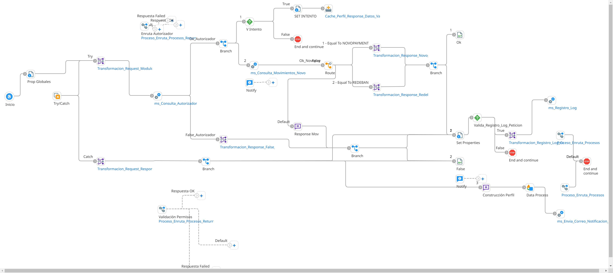

# CONSULTA_MOVIMIENTOS

## ws_Consulta_Movimientos
## ws_Consulta_Movimientos_Total

Frecuencia de ejecucion: por demanda (segun solicitud en linea del usuario)

### Sistemas involucrados: 

- Boomi API (Webhook REST JSON: /ws/simple/executeConsultaMovimientos, /ws/simple/executeConsultaMovimientosTotal)
- Novopayment (operacion: /sodexo_transactions, /sodexo_transactionsAll)
- Condor BD Oracle

### Descripcion general:
Proceso sincronico ejecutado en tiempo real para consulta de movimientos de una cuenta/tarjeta.   

El proceso inicia cuando un usuario final ingresa a consultar los movimientos de su tarjeta. Para ello el sistema origen consume un API de Boomi (webhook). Primero se consulta si existe la tarjeta en Condor. En caso afirmativo, se ejecuta API en Novo y se envia respuesta de forma sincronica. Segun la solicitud del cliente se puede consultar el historico de todas las transacciones (/sodexo_transactionsAll) o un subconjunto (/sodexo_transactions) 

### Actividades del proceso: 
Subproceso principal: `ri_Consulta_Movimientos`

