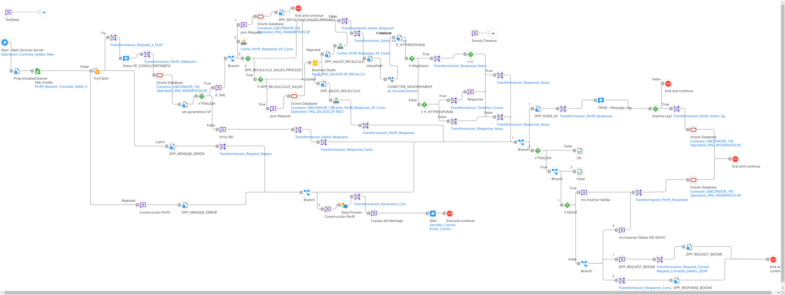
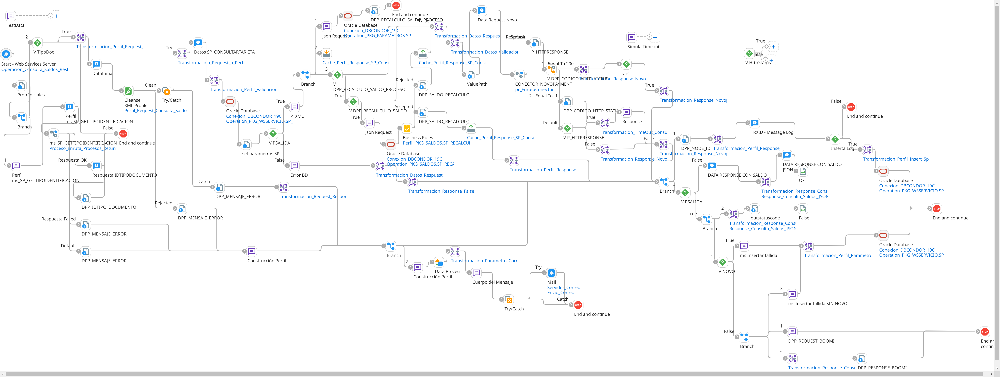

# CONSULTA_SALDOS_NEW

## ws_Consulta_Saldos_New

Frecuencia de ejecucion: por demanda (segun solicitud en linea del usuario)

### Sistemas involucrados: 

- Boomi API (Webhook XML: /ws/simple/getConsultaSaldo, Webhook REST JSON: /ws/simple/executeConsultaSaldoRest)
- Novopayment (operacion: sodexo_balance)
- Condor BD Oracle

### Descripcion general:
Proceso sincronico ejecutado en tiempo real para consulta de saldo de una cuenta/tarjeta.   

El proceso inicia cuando un usuario final ingresa a consultar el saldo de su tarjeta. Para ello el sistema origen consume un API de Boomi (webhook). 

Segun el canal solicitante, el servicio de boomi recalcula el saldo basado en Condor sin consumir API de Novopayment.

    USUARIO:    HABILITA_RECALCULO

    sodexoclub: 1
    condor:	    1
    ivr:	    0

En el caso que no se recalcule (HABILITA_RECALCULO=0), se hace la consulta a Novopayment.

### Actividades del proceso: 
En este flujo todas las actividades se ejecutan en el mismo workflow llamado `ws_Consulta_Saldos_New` para las peticiones XML:

Para las peticiones REST JSON tenemos el flujo `ws_Consulta_Saldos_Rest`:

