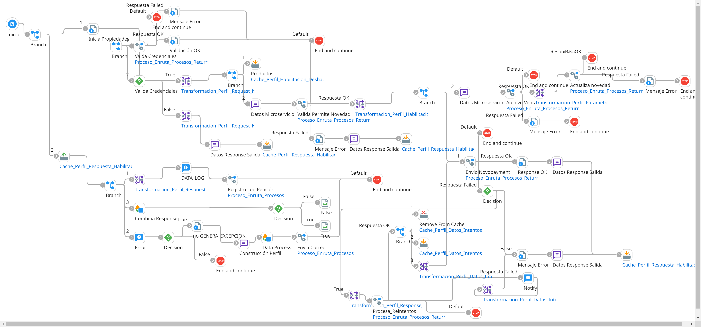

# HABILITACION_DESHABILITACION_COMERCIO

## ws_Habilitacion_Deshabilitacion_Comercio

Frecuencia de ejecucion: por demanda (segun solicitud en linea del usuario)

### Sistemas involucrados: 

- Boomi API (Webhook REST JSON: /ws/simple/executeHabilitacionDeshabilitacionComercio)
- Novopayment (operacion: /sodexo_manageCommerce)

### Descripcion general:
Proceso sincronico ejecutado en tiempo real para HABILITAR o DESHABILITAR un comercio dentro del autorizador Novo.   

El proceso inicia cuando un usuario ingresa a habilitar/deshabilitar un comercio afiliado para recibir transacciones Sodexo-Pluxee. Para ello el sistema origen consume un API de Boomi (webhook). Se ejecuta consulta en Condor, si cumple las validaciones se llama el API en Novo. En caso de falla tecnica con Novo, se realizan reintentos de conexion,  luego de ello se corren SP en Condor BD y se envia respuesta de forma sincronica al webhook. 

### Actividades del proceso: 
Subproceso principal: `ri_Habilitacion_Deshabilitacion_Comercio`

