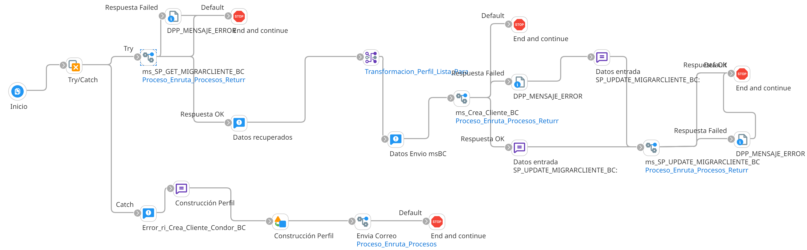

# INTEGRA_CLIENTES

## job_Crear_Cliente_Condor_BC

Frecuencia de ejecucion: por definir (programado por tiempo - scheduler)

### Sistemas involucrados: 

- Microsoft Dynamics Business Central API: https://sdx-finances-third-parties-qa-staging.azurewebsites.net/api/v1/ThirdPartiesClient (QA-Staging)
- Condor BD Oracle


### Descripcion general:
Proceso tipo job sincronico de creacion de clientes por lotes en Business Central (BC) a partir del insumo de datos de Condor BD. El job job_Crear_Cliente_Condor_BC corre periodicamente y hace un llamado al subproceso principal `ri_Crea_Cliente_Condor_BC` que se encarga de obtener los datos detallados de Condor DB a traves de un SP `SP_GET_MIGRARCLIENTE_BC`. 
Luego de esto, se preparan los datos y se hacen las transformaciones respectivas para enviar a Business Central por medio de un llamado a su API. 
Dependiendo de la respuesta de BC, se actualiza en Condor el resultado del proceso a traves de llamado a SP SP_UPDATE_MIGRARCLIENTE_BC. 


### Actividades del proceso: 
Subproceso principal: `ri_Crea_Cliente_Condor_BC`



1. Desde el proceso principal, se invoca el subproceso `ms_SP_GET_MIGRARCLIENTE_BC`. 

    Se ejecuta en Condor BD SP `SP_GET_MIGRARCLIENTE_BC`
    
    Mapeo Transformacion_Perfil_SP_GET_MIGRARCLIENTE_BC_to_Perfil_Lista_Parametros_Entrada_SP_Generico: Perfil_Lista_Parametros_Entrada_SP_Generico

    Si OTROPARAMETRO2 = 1 y PARAMETROS_SP_GENERICO/PARAMETRO1 es vacio, se construye XML:

    ```xml
    <LISTA_PARAMETROS_SP_GENERICO>
    <OTROPARAMETRO2>0</OTROPARAMETRO2>
    <OTROPARAMETRO3>Sin información de cliente</OTROPARAMETRO3>
    </LISTA_PARAMETROS_SP_GENERICO>
    ```      

    De lo contrario, si Si OTROPARAMETRO2 = 1 y PARAMETROS_SP_GENERICO/PARAMETRO1 NO es vacio, retorna true (ok).

    Si OTROPARAMETRO2 <> 1, significa que hubo error con el SP y devuelve false.

    Si ocurre un error durante el proceso (catch), se construye mensaje y devuelve false:

    ```xml
    <LISTA_PARAMETROS_SP_GENERICO>
    <OTROPARAMETRO2>0</OTROPARAMETRO2>
    <OTROPARAMETRO3>{1}</OTROPARAMETRO3>
    </LISTA_PARAMETROS_SP_GENERICO>
    Donde {1} es el mensaje de error capturado en el catch
    ```

2. Si el proceso anterior se realiza, se ejecuta Mapeo  Transformacion_Perfil_Lista_Parametros_Entrada_SP_Generico_to_Perfil_Request_Crear_Cliente_BC: Perfil_Request_Crear_Cliente_BC

3. Se ejecuta el subproceso `ms_Crea_Cliente_BC`

    Mapeo Transformacion_Perfil_Request_Crear_Cliente_BC_to_Perfil_Request_Crear_Cliente_BC_Identity: Perfil_Request_Crear_Cliente_BC
    Mapeo Transformacion_Perfil_Request_Crear_Cliente_BC_to_Perfil_Request_Cliente_BC_JSON: Perfil_Request_Crea_Cliente_BC
    Transformacion (quitar espacios en blanco)

    **Se consume API de Business Central por metodo POST** con JSON de entrada `Perfil_Request_Crea_Cliente_BC` 

    - Si codigo HTTP de respuesta es 200 (ok): Mapeo Transformacion_Perfil_Response_Crear_Cliente_BC_to_Perfil_Response_Crear_Cliente_BC_XML: Perfil_Response_Crear_Cliente_BC

    - Si codigo 400 (error): Mapeo Transformacion_Perfil_Response_Crear_Cliente_BC_Error_to_Perfil_Response_Crear_Cliente_BC_XML: Perfil_Response_Crear_Cliente_BC

    - Otro error: Mapeo Transformacion_Perfil_Sin_Datos_to_Perfil_Response_Crear_Cliente_BC_XML: Perfil_Response_Crear_Cliente_BC

    En todos los casos, ejecutar mapeo Transformacion_Perfil_Response_Crear_Cliente_BC_to_Perfil_Response_Crear_Cliente_BC_Recupera_Cache_Identity: Perfil_Response_Crear_Cliente_BC

    Si valor Respuesta_servicio/Exitoso = 1, retorne true (ok), de lo contrario retorne false (error).

    Si durante el proceso, se genera error, se captura el error (catch), se construye XML y se retorna false (error):

    ```xml
    <Perfil_Response_Crear_Cliente_BC>
    <Respuesta_Servicio>
    <Exitoso>0</Exitoso>
    <Error>{1}</Error>
    <IdLlave>{2}</IdLlave>
    </Respuesta_Servicio>
    </Perfil_Response_Crear_Cliente_BC>

    {1} Mensaje de error 
    {2} IdLlave
    ```
4. Si el anterior proceso retorno true (OK), se construye mensaje:

```xml
<PARAMETROS_SP_GENERICO>
<PARAMETRO2>{1}</PARAMETRO2>
<PARAMETRO3>2</PARAMETRO3>
<PARAMETRO4>OK - {2}</PARAMETRO4>
</PARAMETROS_SP_GENERICO>
Donde 
{1} IdLlave
{2} thirdPartiesClientCode
```
En caso contrario, se construye mensaje:
```xml
<PARAMETROS_SP_GENERICO>
<PARAMETRO2>{1}</PARAMETRO2>
<PARAMETRO3>3</PARAMETRO3>
<PARAMETRO4>{2} - {3}</PARAMETRO4>
</PARAMETROS_SP_GENERICO>
{1} IdLlave
{2} valor campo 'Exitoso'
{3} valor campo 'Error'
```

En ambos casos, se llama al subproceso `ms_SP_UPDATE_MIGRARCLIENTE_BC` que ejecuta en Condor BD `SP_UPDATE_MIGRARCLIENTE_BC` con datos de entrada Perfil_SP_UPDATE_MIGRARCLIENTE_BC.

Mapeo Transformacion_Perfil_SP_UPDATE_MIGRARCLIENTE_BC_to_Perfil_Parametros_Entrada_Generico_Salida: Perfil_Parametros_Entrada_Generico_Salida

Si PARAMETRO2 = 1, retorna true (OK), de lo contrario retorna false (error). 

Si en la ejecucion se genera error, se captura la excepcion (catch), se construye mensaje y devuelve false (error):
```xml
<PARAMETROS_SP_GENERICO>
<PARAMETRO2>0</PARAMETRO2>
<PARAMETRO3>Error general ms_SP_UPDATE_MIGRARCLIENTE_BC: {1}</PARAMETRO3>
</PARAMETROS_SP_GENERICO>
Donde {1} mensaje de error
```

5. Si durante todo el flujo de integracion se captura una excepcion, se envia un correo de notificacion con la descripcion del error.


