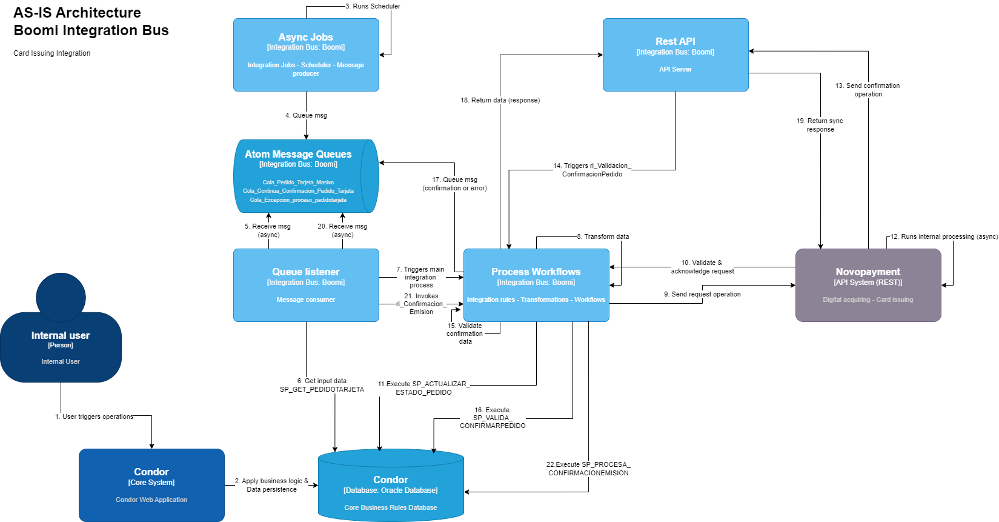

# PEDIDO_TARJETA


**Comunes SODEXO:**
-   **CONECTOR_NOVOPAYMENT**
    -   Envia la lista de tarjeta a emitir en Novopayment.

1. **Colas**
    1. Cola_Pedido_Tarjeta_Masivo
    2. Cola_Pedido_Tarjeta_Condor_Archivo		
	3. Cola_Pedido_Tarjeta_Job
2. **Comunes**
    1. **Microservicios**
        1. **ms_Pedido_Tarjeta_Novopayment**  
            1. Hay un mapeo de XML a JSON, luego vuelve a XML denuevo y ejecuta el proceso ``CONECTOR_NOVOPAYMENT``.
        2. **ms_Pedido_Tarjeta_Novopayment_ACTUALIZA_ESTADO_PEDIDO** 
            1. Hay un mapeo de XML a JSON, luego vuelve a XML denuevo y ejecuta el proceso ``CONECTOR_NOVOPAYMENT``.
			2. Dependiendo del resultado, entran en un mapeo a XML y retornan un OK o un FALSE.
        3. **ms_SP_INSERT_WSTRANSAPENDIENTE**
            1. ejecuta el sp: ``CONDOR.PKG_WSSERVICIO.SP_INSERT_WSTRANSAPENDIENTE``, luego el resultado se mapea a XML  y retorna un OK o un FALSE.
3. **Condor**
    1. **Interfaces**
        1. **job_SP_GENERAR_EMISION**
            1. se conecta a la bd condor y ejecuta el sp : ``CONDOR.PKG_BENEFICIARIOCARGUE.SP_GENERAR_EMISION`` y espera que retorne ``P_SALIDA`` y ``P_TEXTO``.
			Escribe un mensaje en la cola ``Cola_Pedido_Tarjeta_Masivo``, la fecha del proceso del sp de oracle.
        2. **queue_Pedido_Tarjeta_Condor_Archivo_NOPRD**
            1. Se ejecuta escuchando mensajes de la cola ``Cola_Pedido_Tarjeta_Condor_Archivo`` y ejecuta el 
			proceso ``ri_Pedido_Tarjeta_Condor_Archivo``.
        3. **queue_SP_GET_PEDIDOTARJETA_JOB**
            1. Se ejecuta escuchando mensajes de la cola ``Cola_Pedido_Tarjeta_Masivo`` y ejecuta el sp : ``CONDOR.PKG_PEDIDOTARJETA.SP_GET_PEDIDOTARJETA_JOB``
			Luego de obtener los datos del sp, ejecuta el sp: ``CONDOR.PKG_PEDIDOTARJETA.SP_GET_PEDIDOTARJETA_JOB``, hace un mapeo de datos  XML y ejecuta el proceso ``ri_Pedido_Tarjeta_Masivo``.
        4. **ws_Pedido_Tarjeta_Condor**
            1. Se ejecuta escuchando la url ``/ws/simple/executePedidoTarjetaCondor``, ejecuta el objeto ``PedidoTarjetaCondor`` y obtiene un JSON, ese JSON se mapea a un XML. Luego ejecuta el proceso ``ri_Pedido_Tarjeta_Condor``. Luego el resultado de ese proceso, mapea de un XML a JSON y retorna un OK o un FALSE.
        5. **ws_Pedido_Tarjeta_Condor_Archivo**
            1. Se ejecuta escuchando la url ``/ws/simple/executePedidoTarjetaCondorArchivo``, el objeto ``PedidoTarjetaCondorArchivo`` y obtiene un JSON.
			Luego se mapea a un XML y ejecuta el proceso ``ri_Pedido_Tarjeta_Condor_Archivo``. el resultado convierte el XML en JSON y retorna un OK o un FALSE.
    2. **Microservicios**
        1. **ms_SP_ALTAS_INSERTAR**
            Ejecuta el sp: ``CONDOR.PKG_ALTAS.SP_ALTAS_INSERTAR``, luego el resultado se mapea a XML  y retorna un OK o un FALSE.
		2. **ms_SP_BENEF_ALTAS_INSERTAR**
            Ejecuta el sp: ``CONDOR.PKG_WSSERVICIO.SP_BENEF_ALTAS_INSERTAR``, luego el resultado se mapea a XML  y retorna un OK o un FALSE.
		3. **ms_SP_BENEFICIARIO_INS** 
            Ejecuta el sp: ``CONDOR.PKG_BENEFICIARIO.SP_BENEFICIARIO_INS``, luego el resultado se mapea a XML  y retorna un OK o un FALSE.
		4. **ms_SP_BENEFICIARIO_WS_NOVO**
            Ejecuta el sp: ``Perfil_SP_BENEFICIARIO_WS_NOVO``, luego el resultado se mapea a XML  y retorna un OK o un FALSE.
		5. **ms_SP_CAMBIAR_INNOMINADA**
            Ejecuta el sp: ``CONDOR.PKG_WSSERVICIO.SP_CAMBIAR_INNOMINADA``, luego el resultado se mapea a XML  y retorna un OK o un FALSE.
		6. **ms_SP_CLIENTE_CONSULTAR**
            Ejecuta el sp: ``CONDOR.PKG_CLIENTE.SP_CLIENTE_CONSULTAR``, luego el resultado se mapea a XML  y retorna un OK o un FALSE.
		7. **ms_SP_CONSULTAR_PRODUCTO**
            Ejecuta el sp: ``CONDOR.PKG_PRODUCTO.SP_CONSULTAR_PRODUCTO``, luego el resultado se mapea a XML  y retorna un OK o un FALSE.
		8. **ms_SP_CREAR_PEDIDO**
            Ejecuta el sp: ``CONDOR.PKG_PEDIDOTARJETA.SP_CREAR_PEDIDO``, luego el resultado se mapea a XML  y retorna un OK o un FALSE.
		9. **ms_SP_CREARDETALLEPEDIDO**
            Ejecuta el sp: ``CONDOR.PKG_PEDIDOTARJETA.SP_CREARDETALLEPEDIDO``, luego el resultado se mapea a XML  y retorna un OK o un FALSE.
		10. **ms_SP_CREARDETALLEPEDIDO_Archivo**
            Ejecuta el sp: ``CONDOR.PKG_PEDIDOTARJETA.SP_CREARDETALLEPEDIDO``, luego el resultado se mapea a XML  y retorna un OK o un FALSE.
		11. **ms_SP_VALIDAR_BENEFICIARIO_WS**
            Ejecuta el sp: ``CONDOR.PKG_WSSERVICIO.SP_VALIDAR_BENEFICIARIO_WS``, luego el resultado se mapea a XML  y retorna un OK o un FALSE.
		12. **ms_SP_VALIDAR_CARD_WS**
            Ejecuta el sp: ``CONDOR.PKG_WSSERVICIO.SP_VALIDAR_CARD_WS``, luego el resultado se mapea a XML  y retorna un OK o un FALSE.
    3. **Reglas de Integración**
        1. **ri_Pedido_Tarjeta_Condor**

            

            1. Recibe el XML y ejecuta el proceso ``ms_SP_VALIDAR_CARD_WS``.
			2. Luego ejecuta el proceso ``ms_SP_CONSULTAR_PRODUCTO``.
			3. Luego hay un mapeo de XML a XML y ejecuta el proceso ``ri_Validaciones_Pedido_Tarjeta_Condor``. Si se ejecuta correctamente sigue al paso d, sino continua al paso e.
			4. Luego ejecuta el proceso ``ms_Pedido_Tarjeta_Novopayment``. 
				- Si el resultado es un OK, ejecuta el proceso ``ms_SP_ACTUALIZAR_ESTADO_PEDIDO``
				- Si el resultado es FALSE, entra a un regla de negocio de reintento.
					- Si el reintento es aceptado, envia un mensaje a la cola ``Cola_Excepcion_proceso_pedidotarjeta`` y ejecuta el proceso ``ms_SP_INSERT_WSTRANSAPENDIENTE``
					- Si el reitento falla, hay un mapeo de XML a XML y ejecuta el proceso ``ms_Procesa_Reintentos``.
						- Si el reintento devuelve un OK, mapea de XML a XML y regresa al paso 4, ejecuntando el proceso ``ms_Pedido_Tarjeta_Novopayment``.
						- Si el reintento falla, ejecuta el proceso ``ms_SP_INSERT_WSTRANSAPENDIENTE`` y tambien ejecuta el proceso ``ms_SP_ACTUALIZAR_ESTADO_PEDIDO``
			5. Luego entra al proceso de registros de logs ``ms_Registro_Log``
			6. Luego ejecuta el proceso ``Envia_Correo_Notificacion``.
			7. Luego hay un mapeo de XML a XML luego entra en una combinacion de datos XML, el resultado entra en otro mapeo de XML a XML y retorna un OK o un FALSE.
        2. **ri_Pedido_Tarjeta_Condor_Archivo**
            

            1. Validamos si el parametro recibido ``DPP_INTERFACE`` es igual a ``1`` Si es correcto entonces ejecuta el paso siguiente, sino al paso b.
			    -   Entra en un mapeo de datos, de XML a XML y ejecuta el proceso ``ms_SP_BENEF_ALTAS_INSERTAR``.
				-   Luego entra en otro mismo mapeo de XML a XML y ejecuta el proceso ``ms_SP_CAMBIAR_INNOMINADA``.
				-   Luego envia un mensaje a la cola ``Cola_Pedido_Tarjeta_Condor_Archivo``
			2. Se ejecuta el proceso ``ms_SP_BENEFICIARIO_WS_NOVO``. Si el proceso falla pues ahi termina este paso, sino continua con el proceso de ``ms_SP_CREAR_PEDIDO``.
			3. Luego ejecuta el proceso ``ms_SP_CLIENTE_CONSULTAR``.
			4. Luego ejecuta el proceso ``ms_SP_CREARDETALLEPEDIDO_Archivo``.
			5. Entra en un mapeo de datos XML a XML y ejecuta el proceso ``ms_Pedido_Tarjeta_Novopayment``.
				- Si se ejecuta correctamente, entonces ejecuta el proceso ``ms_SP_ACTUALIZAR_ESTADO_PEDIDO``.
				- Pero si falla, entra en una validacion de reintento.
					- Si el reintento es aceptado, manda un mensaje a la cola ``Cola_Excepcion_proceso_pedidotarjeta``.
					- Luego ejecuta el proceso ``ms_SP_INSERT_WSTRANSAPENDIENTE``.
					- Pero si el reintento falla, entra en un mapeo de XML a XML y ejecuta el proceso ``ms_Procesa_Reintentos``
					    - Si el proceso se ejecuto correctamente, entonces entra por otro mapeo de XML a XML y vuelve al paso 5, que es ejecutar el proceso ``ms_Pedido_Tarjeta_Novopayment``.
						-   Si no entonces ejecuta el proceso ``ms_SP_ACTUALIZAR_ESTADO_PEDIDO`` y luego el proceso ``ms_SP_INSERT_WSTRANSAPENDIENTE``.
			6. Luego ejecuta el proceso ``ms_Registro_Log``.
			7. Luego ejecuta el proceso ``Envia_Correo_Notificacion``
			8. Por ultimo retorna un OK o un FALSE.
        3. **ri_Pedido_Tarjeta_Masivo**
            

            1. Hay un mapeo de datos de XML a XML y entra en un enrutamiento que valida la cantidad de tarjetas.
			2. Si la cantidad de tarjetas es mayor a 10 entonces continua con los pasos, sino aqui termina.
			3. Luego entra en un proceso de 15 hilos asincronos donde ejecuta el proceso ``ms_Registro_Log``.
			4. Luego ejecuta el proceso ``ms_Pedido_Tarjeta_Novopayment``.
				-   Si la respuesta es un OK, entra al proceso ``ms_SP_ACTUALIZAR_ESTADO_PEDIDO`` y termina.
				-   Pero si la respuesta es FALSE, valida el ``rc`` si es igual a ``999`` o ``9999``, dependiendo de eso arma un mensaje y ejecuta el proceso ``ms_SP_ACTUALIZAR_ESTADO_PEDIDO``.
				-   Luego ejecuta el proceso ``ms_SP_INSERT_WSTRANSAPENDIENTE``
				-   Y por ultimo ejecuta el proceso ``ms_INSERTAR_PETICIONFALLIDA``.
			5. Luego ejecuta el proceso ``Envia_Correo_Notificacion``
			6. Y por ultimo se ejecuta el proceso de ``ms_Registro_Log``.
        4. **ri_Pedido_Tarjeta_Masivo_New**
            
            1. Empieza con unos mapeos de XML a XML y entra al proceso de 15 hilos asincronos donde primero se conecta a la BD de CONDOR y ejecuta el sp ``CONDOR.PKG_WSSERVICIO.SP_INSERT_WSLOGPETICION``
			2. Luego se conecta a Novopayment usando la url ``http://172.24.6.79:8022/sodexoapi/1.0`` y nos retorna un JSON.
			3. Dependiendo de lo que nos responde Novopayment, preparamos el mensaje correcto, luego mapeamos el JSON a XML.
			4. luego validamos el ``rc`` si es ``999`` o ``9999``, mapeamos a XML y ejecutamos el sp ``CONDOR.PKG_PEDIDOTARJETA.SP_ACTUALIZAR_ESTADO_PEDIDO``.
			5. Luego ejecutamos otro sp ``CONDOR.PKG_WSSERVICIO.SP_INSERT_WSTRANSAPENDIENTE``.
			6. Tambien ejecutamos el sp ``CONDOR.PKG_WSSERVICIO.SP_INSERTAR_PETICIONFALLIDA``.
			7. Validamos la respuesta del proceso anterior.
				-   si es correcta, entonces ejecuta el proceso de envio de correo que es:
                    ```
                    Host: smtp.gmail.com
                    Port: 465
                    User Name: busserviciossodexocolombia@gmail.com
                    Password: encrypted
                    From: busserviciossodexocolombia@gmail.com 
                    To: luiscarlos.antequerapena@sodexo.com
                    subject Prueba correo
                    Content Type: txt/html
                    ```
				-   Si es falsa entonces ejecta el sp ``CONDOR.PKG_WSSERVICIO.SP_INSERT_WSLOGPETICION`` y termina la todo.
        5. **ri_Validaciones_Pedido_Tarjeta_Condor**
            
            1. Lo primero que ejecta es el proceso ``ms_SP_VALIDAR_BENEFICIARIO_WS``
				-   Si la respuesta es correcta entonces, entra en un mapeo de XML a XML y ejecuta el proceso ``ms_SP_BENEFICIARIO_INS``.
				-   Luego ejecuta el proceso ``ms_SP_ALTAS_INSERTAR``.
					-   Si la respuesta es OK, entonces ejecuta el proceso ``ms_SP_CONSULTAR_PRODUCTO``.
						-   Si la respuesta es OK, ejecuta el proceso ``ms_SP_CAMBIAR_INNOMINADA``.
						-   Luego ejecuta el proceso ``ms_SP_CREAR_PEDIDO``.
						-   Luego ejecuta el proceso ``ms_SP_CREARDETALLEPEDIDO``, que valida si la respuestas es correcta o no. Si la respuesta es correcta, ejecuta el proceso ``ms_SP_CONSULTAR_PRODUCTO``. Si es correcto, ejecuta el proceso ``ms_SP_CLIENTE_CONSULTAR`` y retorna un OK.
			2. Si todos los procesos son fallidos, todos estan conectados al mismo retorno de FALSE.
4. **Sodexo_Express**
    1. **Interfaces**
        1. **job_Pedido_Tarjeta_Sodexo_Express**
            Se conecta a la cola ``Cola_Pedido_Tarjeta_Job`` y le envia un mensaje de la hora actual de ejecucion.
        2. **queue_Pedido_Tarjeta_Sodexo_Express**
            Es un proceso de escucha de la cola ``Cola_Pedido_Tarjeta_Job`` y ejecuta el proceso ``ri_Pedido_Tarjeta``.
    2. **Microservicios**
        1. **ms_SP_GET_PEDIDOTARJETA_SEXPRESS**
            Ejecuta el sp: ``CONDOR.PKG_PEDIDOTARJETA.SP_GET_PEDIDOTARJETA_SEXPRESS``, la respuesta lo transforma en XML y retorna un OK o un FALSE.
    3. **Reglas de Integracion**
        1. **ri_Pedido_Tarjeta_Sodexo_Express**
            
            
            1. Inicia con una validacion del parametro DPP_INTERFACE es igual a job, si es correcto entonces ejecuta el proceso ``ms_SP_GET_PEDIDOTARJETA_SEXPRESS``, entra en un mapeo de XML a XML y entra en un Flow Control de 5 hilos asincronos.
			2. Si la validacion da False, igual entra al mismo Flow Control de 5 hilos asincronos pero sin mapeo de datos.
			3. Luego ejecuta el proceso ``ms_Pedido_Tarjeta_Novopayment``.
				-   Si se ejecuta correctamente, Luego arma un mensaje y ejecuta el proceso ``ms_SP_ACTUALIZAR_ESTADO_PEDIDO``.
					-   Si falla entra en una validacion si el parametro ``rc`` es igual a ``999``. Dependiendo de la respuesta arma un mensaje y ejecuta el proceso ``ms_SP_ACTUALIZAR_ESTADO_PEDIDO``.
					-   Ejecuta el proceso ``ms_SP_INSERT_WSTRANSAPENDIENTE``.
					-   Ejecuta el proceso ``ms_INSERTAR_PETICIONFALLIDA``.
			4. Luego entramos en una validacion del parametro ``DPP_EXCEPCION`` es igual a ``1``.
				-   Si es correcto, se ejecuta el proceso ``Envia_Correo_Notificacion``.
				-   Si es falso entra en otra validacion del parametro ``DPP_PSALIDA`` si es igual a ``1``.
					-   Si es correcto, entra en un mapeo de XML a XML y ejecuta el proceso ``ms_Registro_Log``.
					-   si es falso, arma un mensaje especifico y ejecuta el mismo proceso ``ms_Registro_Log``.