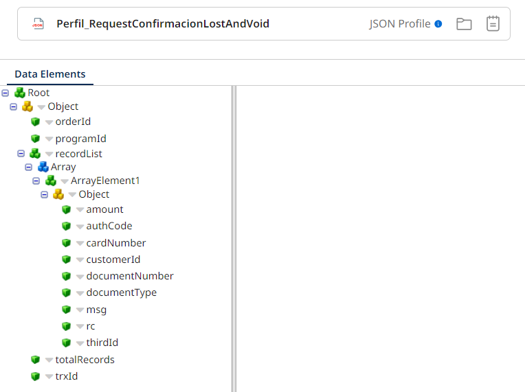

# Confirmación LostAndVoid

## ws_Confirmacion_LostandVoid

Frecuencia de ejecucion: a demanda 

### Sistemas involucrados: 

 - Novopayment 
 - Boomi Application Server (API): [APPSERVER_NAME]:[PORT]/ws/simple/executeConfirmacionLostandVoid
- Condor DB Oracle


### Descripcion general:
Despues de enviar los pedidos LostAndVoid para bloqueo al autorizador Novopayment, este ultimo procesa la solicitud y en un flujo asincrónico llama un Web service de Pluxee llamado `executeConfirmacionLostandVoid` con el objetivo de confirmar los pedidos de bloqueo LostAndVoid previamente enviados. 
La estructura de entrada del mensaje de confirmacion incluye el numero del pedido (orderId), trxId, programId, totalRecords y un array con el listado de tarjetas afectadas en el proceso.

Con esta informacion y las transformaciones necesarias, se ejecuta en  Condor BD ``. 

Si existen carga no exitosas, se ejecuta en Condor BD `SP_CONFIRMAR_NO_CARGA`.

Luego se ejecuta `SP_CONFIRMAR_SI_CARGA`.

En caso de errores en el proceso se ejecuta en Condor `PKG_WSSERVICIO.SP_INSERTAR_PETICIONFALLIDA`    


### Variables globales:
- OPERACION 
- DPP_ID_PRODUCTO
- DPP_TRX_ID
- DPP_TOTAL_RECORDS
- DPP_INTERFACE
- DPP_CANTIDAD
- DPP_TOTAL_RECORDS

### Actividades del proceso: 
Subproceso principal: `ri_Confirmacion_LostAndVoid`

1. Novo invoca el web service `executeConfirmacionLostandVoid` con el siguiente perfil de entrada (request):



2. Se invoca el subproceso principal `ri_Confirmacion_LostAndVoid`

3. Se inicializan variables OPERACION, DPP_ID_PRODUCTO, DPP_TRX_ID, DPP_TOTAL_RECORDS.

4. Mapeo Transformacion_Perfil_RequestConfirmacionLostandVoid_To_Perfil_Generico: Perfil_Parametros_Entrada_Generico_Salida

5. Se inicializa variable DPP_CANTIDAD

6. Si DPP_INTERFACE = 'ws' (por defecto es 'ws') y si DPP_CANTIDAD <> DPP_TOTAL_RECORDS, significa que la cantidad de tarjetas enviadas por Novo no coinciden con las enviadas en la solicitud. Entonces, se genera XML y retorna respuesta de error:

```xml
    <ConfirmacionLostandVoidResponse>
    <CodigoError>403</CodigoError>
    <Descripcion>Cantidad de documentos no coincidente</Descripcion>
    <pSalida>-1</pSalida>
    </ConfirmacionLostandVoidResponse>
```

De lo contrario, si DPP_INTERFACE='ws' y coinciden los registros, retorna mensaje de respuesta satisfactorio:

```xml
    <ConfirmacionLostandVoidResponse>
    <CodigoError>200</CodigoError>
    <Descripcion>Mensaje recibido con exito</Descripcion>
    <pSalida>0</pSalida>
    </ConfirmacionLostandVoidResponse>
```
Luego, si la cantidad de tarjetas coinciden y no se generan errores, se envia mensaje a la cola `Cola_ConfirmacionLostandVoid`. 

Para el caso DPP_INTERFACE<>'ws' (valor 'queue'), se ejecuta subproceso [ms_SP_CONFIRMACION_LOSTANDVOID](ms_SP_CONFIRMACION_LOSTANDVOID
) que corre en Condor BD `PKG_LOSTANDVOID.SP_CONFIRMACION_LOSTANDVOID` (SP). Esto sucende cuando el web service de boomi ya ha recibido la solicitud y la encola para su procesamiento en Condor.

Si hay falla en el proceso, envia correo de notificacion y escribe logs.

7. Existe un proceso listener llamado `queue_Confirmacion_LostandVoid` que esta escuchando mensajes en la cola `Cola_ConfirmacionLostandVoid`. Una vez llega un mensaje a la cola lanza el subproceso principal  `ri_Confirmacion_LostAndVoid` con la variable DPP_INTERFACE ='queue'. 


### ms_SP_CONFIRMACION_LOSTANDVOID
Este subproceso se encarga de guardar la confirmacion de LostAndVoid enviada por Novo en Condor BD.
Mapeo Transformacion_Perfil_Generico_To_Perfil_Generico:
Perfil_Parametros_Entrada_Generico_Salida con funcion Funcion_Llave_Documento para generar IDRECORD.
Quitar y guardar cache Perfil_Parametros_Entrada_Generico_Salida
Mapeo Transformacion_Perfil_Parametros_Entrada_Generico_Salida_to_Perfil_PKG_LOSTANDVOID.SP_CONFIRMACION_LOSTANDVOID_Request: Perfil_PKG_LOSTANDVOID.SP_CONFIRMACION_LOSTANDVOID_Request.
Correr en Condor BD `PKG_LOSTANDVOID.SP_CONFIRMACION_LOSTANDVOID` (SP).
Enviar respuesta del SP al proceso principal a partir de transformacion del Perfil_PKG_LOSTANDVOID.SP_CONFIRMACION_LOSTANDVOID_Response. 

