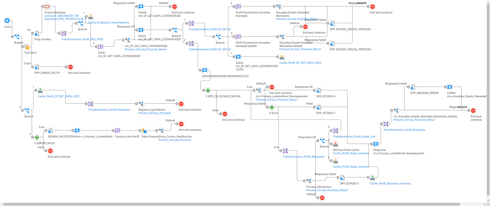

# PROCESO_LOSTANDVOID

## Job_ProcesoLostAndVoid

Frecuencia de ejecucion: mensual 

### Sistemas involucrados: 

 - Novopayment API: https://tomcat-uat-sodexo.novopayment.net/sodexoapi/1.0/{2}/employee/{1}{4}{3}
	
    `{1}` Value_employee
	
    `{2}` value_programId
	
    `{3}` value_trxid
	
    `{4}` value_path_operation
- Condor BD Oracle
- Boomi: Cola_Proceso_LostAndVoid

### Descripcion general:
Proceso de bloqueo masivo de cuentas (tarjetas) en Novopayment a partir del insumo de datos de Condor BD. El job proceso lost and void escribe mensajes en la cola boomi `Cola_Proceso_LostAndVoid` y otro proceso escucha los nuevos mensajes que llegan a dicha cola (Publish - Subscribe) y hace un llamado al subproceso principal `ri_Proceso_LostAndVoid` que se encarga de obtener los datos detallados de Condor DB a traves de un SP `SP_GET_DATA_LOSTANDVOID` dados los id productos obtenidos como parametros. 
Luego de esto, se preparan los datos y se hacen las transformaciones respectivas para enviar a Novopayment por medio de un llamado a su API. 
Dependiendo de la respuesta de Novo, se actualiza en Condor el resultado del proceso a traves de llamados a varios SP. 


### Variables globales:
- OPERACION
- DPP_ESTADO
- DPP_OK_ESTADO_INICIAL


### Actividades del proceso: 
Subproceso principal: `ri_Proceso_LostAndVoid`

1. Se construye el mensaje 
    ```xml
        {1} Fecha actual formato YYYYMMdd HHmmss.SSS
        <PARAMETROS_SP_GENERICO>
            <PARAMETRO1>Ejecución Proceso LostAndVoid</PARAMETRO1>
            <PARAMETRO2>{1}</PARAMETRO2>
        </PARAMETROS_SP_GENERICO>
    ```
    Se utiliza la cola de boomi `Cola_Proceso_LostAndVoid` con la operacion de enviar / encolar mensajes  `Operacion_Evia_Cola_Proceso_LostAndVoid`.
    Tamaño de batch de envio: 5

2. Se corre el proceso queue_ProcesoLostAndVoid que escucha nuevos mensajes en la cola `Cola_Proceso_LostAndVoid` con la operacion `Operacion_Escucha_Cola_Proceso_LostAndVoid` y llama el subproceso principal `ri_Proceso_LostAndVoid`



3. Establecer variable OPERACION

4. Ejecutar en Condor BD Operation_PKG_PRODUCTO.SP_PRODUCTOS_NOVOPAYMENT: `PKG_PRODUCTO.SP_PRODUCTOS_NOVOPAYMENT` (SP), Mapeo `Transformacion_Perfil_PKG_PRODUCTO.SP_PRODUCTOS_NOVOPAYMENT_Response_to_Perfil_Productos_NovoPayment`: `Perfil_Productos_NovoPayment`, guardar cache.

5. Construir XML:
 ```xml
   {1} IDPRODUCTO
   {2} IDPRODUCTO_NOVO
    <PARAMETROS_SP_GENERICO>
        <PARAMETRO2>{1}</PARAMETRO2>
        <PARAMETRO3>{2}</PARAMETRO3>
    </PARAMETROS_SP_GENERICO>
```

6. Invocar subproceso ms_SP_GET_DATA_LOSTANDVOID:

    Mapeo Transformacion_Perfil_Parametros_Entrada_Generico_Salida_to_Perfil_Parametros_Entrada_Generico_Salida_SP_GETLOSTANDVOID: Perfil_Parametros_Entrada_Generico_Salida, agregando IDRECORD con una funcion de concatenacion entre ID_RECORD y ID_EJECUCION (FUNCION: `Funcion_Llave_Documento`). Para obtener ID_EJECUCION se corre el siguiente script:

        import com.boomi.execution.ExecutionUtil;
        ID_EJECUCION = ExecutionUtil.getRuntimeExecutionProperty ("EXECUTION_ID");
        ID_EJECUCION = ID_EJECUCION.substring(10,ID_EJECUCION.length()-11); 

    Guardar cache

    Ejecutar en Condor BD `Operacion_SP_GET_DATA_LOSTANDVOID`,
    Mapeo a XML `Transformacion_Perfil_SP_GET_DATA_LOSTANDVOID_to_Perfil_SP_GET_DATA_LOSTANDVOID_XML`: `Perfil_SP_GET_DATA_LOSTANDVOID`

    Si P_SALIDA=1 (Sin error) y IDNOVEDADMONETARIA NO es vacio (hay datos):

        Mapeo Transformacion_Perfil_SP_GET_DATA_LOSTANDVOID_to_Perfil_SP_GET_DATA_LOSTANDVOID_IDENTITY: Perfil_SP_GET_DATA_LOSTANDVOID 
        Quitar del cache Cache_Perfil_Parametros_Entrada_Generico_Salida

    Si P_SALIDA=1 (Sin Error) y IDNOVEDADMONETARIA es vacio (sin datos): 
     ```xml
    <SP_GET_DATA_LOSTANDVOID>
        <PSALIDA>0</PSALIDA>
        <PTEXTO>Sin Datos</PTEXTO>
    </SP_GET_DATA_LOSTANDVOID>

     ```
    Si P_SALIDA<>1 (Error): 
     ```xml
    <SP_GET_DATA_LOSTANDVOID>
        <PSALIDA>0</PSALIDA>
        <PTEXTO>{1}</PTEXTO>
    </SP_GET_DATA_LOSTANDVOID>
    ```
    

7. Si se obtienen datos en Condor BD: 

    Mapeo `Transformacion_Perfil_SP_GET_DATA_LOSTANDVOID_to_Perfil_SP_GET_DATA_LOSTANDVOID_ENCABEZADO`: `Perfil_SP_GET_DATA_LOSTANDVOID_ENCABEZADO`
    
    Guardar cache Perfil_SP_GET_DATA_LOSTANDVOID_ENCABEZADO

    Construir mensaje: 
    ```xml    
    {1} IDNOVEDADMONETARIA
    <PARAMETROS_SP_GENERICO>
        <PARAMETRO1>{1}</PARAMETRO1>
        <PARAMETRO2>3</PARAMETRO2>
    </PARAMETROS_SP_GENERICO>
    ```
    Ejecuta subproceso `ms_actualiza_estado_novedad_monetaria` con el XML anterior: ejecutar en Condor BD `PKG_ARCHIVOSSALIDA.SP_UPDATE_NOVEDADMONETARIA` (SP) con respuesta a un mensaje XML, donde variable `P_SALIDA` en 0 o 1 segun la respuesta del SP. 

    ```xml    
    {1} P_TEXTO
    <RESPUESTA_PROCEDIMIENTO_ALMACENADO>
        <P_SALIDA>0|1</P_SALIDA>
        <P_TEXTO>{1}</P_TEXTO>
    </RESPUESTA_PROCEDIMIENTO_ALMACENADO>
    ```

    Luego, construir mensaje
    ```xml 
    {1} IDNOVEDADMONETARIA
    <SP_PARAMETROS_ACTUALIZA_NOVEDAD_MONETARIA_DETALLE>
        <P_IDNOVEDADMONETARIA>{1}</P_IDNOVEDADMONETARIA>
        <P_IDESTADO>3</P_IDESTADO>
        <P_NROCUENTA>0</P_NROCUENTA>
    </SP_PARAMETROS_ACTUALIZA_NOVEDAD_MONETARIA_DETALLE>
    ```
    Ejecuta subproceso `ms_Actualiza_Estado_Novedad_Monetaria_Detalle` con el XML anterior: mapeo `Transformacion_Perfil_SP_PARAMETROS_ACTUALIZA_NOVEDAD_MONETARIA_DETALLE_to_Perfil_PKG_ARCHIVOSSALIDA.SP_UPD_DETAILNOVEDADMONETARIA_Request`, Ejecutar en Condor BD `PKG_ARCHIVOSSALIDA.SP_UPD_DETAILNOVEDADMONETARIA` (SP). 
    
    Si respuesta P_SALIDA=1:
    ```xml 
    {1} P_SALIDA
    <RESPUESTA_PROCEDIMIENTO_ALMACENADO>
    <P_SALIDA>1</P_SALIDA>
    <P_TEXTO>{1}</P_TEXTO>
    </RESPUESTA_PROCEDIMIENTO_ALMACENADO>
    ```
    Si respuesta P_SALIDA<>1:
    ```xml 
    {1} P_SALIDA
    <RESPUESTA_PROCEDIMIENTO_ALMACENADO>
    <P_SALIDA>0</P_SALIDA>
    <P_TEXTO>{1}</P_TEXTO>
    </RESPUESTA_PROCEDIMIENTO_ALMACENADO>
    ```

    Vuelve al proceso principal, mapeo `Transformacion_Perfil_SP_GET_DATA_LOSTANDVOID_to_Perfil_Request_Proceso_LostAndVoid_Novopayment`: `Perfil_Request_Proceso_LostAndVoid_Novopayment` 
    
    Si DPP_OK_ESTADO_INICIAL=1, ejecuta subproceso `ms_Proceso_LostAndVoid_Novopayment`:

    Establecer variables ID_RECORD, P_OPERACION_TRXID_MASIVO
    
    Mapeo `Transformacion_Perfil_Request_Proceso_LostAndVoid_Novopayment_to_Perfil_Request_Proceso_LostAndVoid_Novopayment_IDENTITY_Oracle_19`: `Perfil_Request_Proceso_LostAndVoid_Novopayment` que incluye las funciones `funcion_llave_documento` y `Funcion_Crea_TRXID_Masivo_Connection_Oracle_19`

    Borrar y guardar nuevamente cache `Cache_Perfil_Request_Proceso_LostAndVoid_Novopayment`

    Mapeo `Transformacion_Perfil_Request_Proceso_LostAndVoid_Novopayment_to_Perfil_Request_Proceso_LostAndVoid_Novopayment_JSON`: `Perfil_Request_Proceso_LostAndVoid_Novopayment`

    Establecer variable `OPERACION`

    Llamar al subproceso `ConnectorHttpClientNovopayment` que se encarga de autenticarse o validar token existente y luego ejecutar el llamado respectivo a Novopayment API. 

    Si en la respuesta de Novo `rc` no es vacio (sin error)

        Mapeo a XML  `Transformacion_Perfil_Response_Proceso_LostAndVoid_Novopayment_to_Perfil_Response_Proceso_LostAndVoid_Novopayment_XML`: `Perfil_Response_Proceso_LostAndVoid_Novopayment`  
        Mapeo `Transformacion_Perfil_Response_Proceso_LostAndVoid_Novopayment_to_Perfil_Response_Proceso_LostAndVoid_Novopayment_IDENTITY`: `Perfil_Response_Proceso_LostAndVoid_Novopayment`

        Si rc = 0 (sin error):
        Guardar cache Cache_Perfil_Response_Proceso_LostAndVoid_Novopayment

        Si rc <> 0, construir XML:
        <Perfil_Response_Proceso_LostAndVoid_Novopayment>
        <rc>{1}</rc>
        <msg>{2}</msg>
        <trxId>{3}</trxId>
        <IDENTITY>{4}</IDENTITY>
        <transactionDate></transactionDate>
        <IDNOVEDADMONETARIA_PRODUCTO>{5}</IDNOVEDADMONETARIA_PRODUCTO>
        </Perfil_Response_Proceso_LostAndVoid_Novopayment>

    De lo contrario (error generico), mapeo `Transformacion_Perfil_Error_Generico_Novopayment_to_Perfil_Response_Proceso_LostAndVoid_Novopayment`: `Perfil_Response_Proceso_LostAndVoid_Novopayment`  
    Construir XML: 
    ```xml
    <Perfil_Response_Proceso_LostAndVoid_Novopayment>
    <rc>{1}</rc>
    <msg>{2}</msg>
    <trxId>{3}</trxId>
    <IDENTITY>{4}</IDENTITY>
    <transactionDate></transactionDate>
    <IDNOVEDADMONETARIA_PRODUCTO>{5}</IDNOVEDADMONETARIA_PRODUCTO>
    </Perfil_Response_Proceso_LostAndVoid_Novopayment>
    ```

    Si la respuesta de Novo no devuelve codigo 200, Mapeo `Transformacion_Perfil_Sin_Datos_to_Perfil_Response_Proceso_LostAndVoid_Novopayment`: `Perfil_Response_Proceso_LostAndVoid_Novopayment`
    
    Construir XML:
    ```xml
    {1} Http error code
    {2} Http error message
    {3} TRX_ID
    {4} {5} IDENTITY
    <Perfil_Response_Proceso_LostAndVoid_Novopayment>
        <rc>999</rc>
        <msg>{1} - {2}</msg>
        <trxId>{3}</trxId>
        <IDENTITY>{4}</IDENTITY>
        <transactionDate></transactionDate>
        <IDNOVEDADMONETARIA_PRODUCTO>{5}</IDNOVEDADMONETARIA_PRODUCTO>
    </Perfil_Response_Proceso_LostAndVoid_Novopayment>
    
    ```
    Guardar cache Cache_Perfil_Response_Proceso_LostAndVoid_Novopayment y vuelve al proceso principal.

    Mapeo Transformacion_Perfil_Response_Proceso_LostAndVoid_Novopayment_to_Perfil_Datos_Intento: Perfil_Datos_Intento

    Se procesan reintentos en caso de rc=999, llamando al subproceso `ms_procesa_reintentos` y al subproceso `ms_Proceso_LostAndVoid_Novopayment`.

    Luego de realizado el proceso en novo, mapeo `Transformacion_Perfil_Response_Proceso_LostAndVoid_Novopayment_to_Perfil_SP_PARAMETROS_ACTUALIZA_NOVEDAD_MONETARIA_DETALLE`: `Perfil_SP_PARAMETROS_ACTUALIZA_NOVEDAD_MONETARIA_DETALLE` con actualizacion DPP_ESTADO y llamado al subproceso Condor BD: `ms_Actualiza_Estado_Novedad_Monetaria_Detalle`


