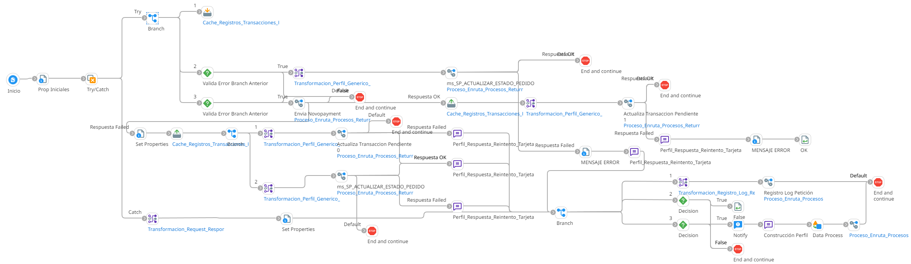

# REEINTENTOS_PEDIDO_TARJETA

## job_Reintento_Pedido_Tarjeta

Frecuencia de ejecucion: Programado

### Sistemas involucrados: 

- Condor BD Oracle
- Novopayment: /sodexo_issuanceList

### Descripcion general:

El proceso inicia cuando un scheduler lanza el Job para el reeintento pedido tarjeta nuevo Para ello se ejecuta en Condor BD `SP_ACTUALIZAR_ESTADO_PEDIDO` y si se valida correctamente ejecuta `SP_UPDATE_TRANSPENDIENTE`.Una vez realizado las validaciones en condor se ejecuta API Novo con la operacion `sodexo_issuanceList` y hace efectiva nuevamente conexion en condor y ejecuta `SP_UPDATE_TRANSPENDIENTE`

### Actividades del proceso: 
Subproceso principal: `ri_Reintentos_Pedido_Tarjeta_Borrar`

