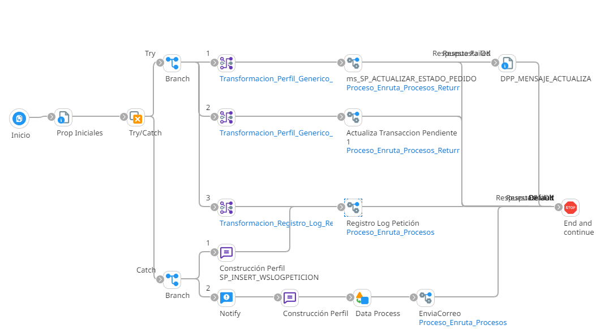

# REEINTENTOS_PEDIDO_TARJETA

## job_Reintento_Pedido_Tarjeta

Frecuencia de ejecucion: Programado

### Sistemas involucrados: 

- Condor BD Oracle

### Descripcion general:

El proceso inicia cuando un scheduler lanza el Job para el reeintento pedido tarjeta nuevo Para ello se ejecuta en Condor BD `SP_ACTUALIZAR_ESTADO_PEDIDO` y si se valida correctamente ejecuta `SP_UPDATE_TRANSPENDIENTE`.Luego de esto efectua  `Operacion_Registro_Log` con el `SP_INSERT_WSLOGPETICION`.

### Actividades del proceso: 
Subproceso principal: `ri_Reintentos_Pedido_Tarjeta_Nuevo`

