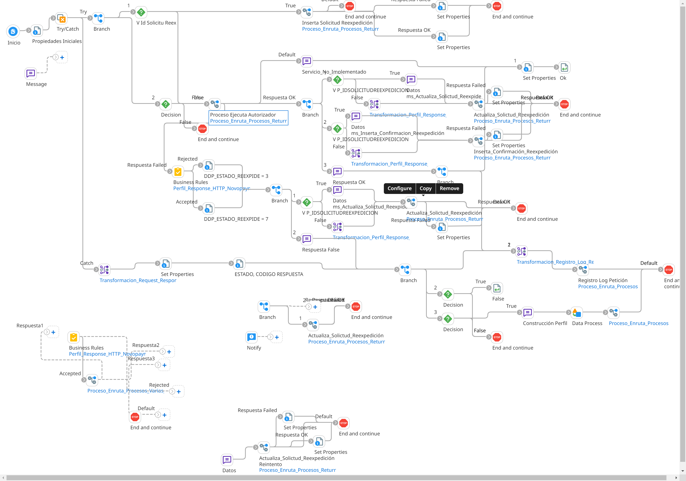

# REEXPEDICION_TARJETA

## job_Reexpide_Tarjeta

Frecuencia de ejecucion: Programado

### Sistemas involucrados: 

- Novopayment (operacion: /sodexo_replaceCard)
- Condor BD Oracle

### Descripcion general:
Proceso Job sincronico ejecutado para reexpedir tarjetas.   

El proceso inicia cuando un scheduler lanza el Job job_Reexpide_Tarjeta. Para ello se ejecuta en Condor BD `SP_GET_SOLICITUD_REEXPEDICION` y si hay datos se lanza el subproceso principal `ri_Reexpide_Tarjeta`

Si `IDSOLICITUDREEXPEDICION` = 0, se ejecuta en Condor BD `SP_INSERTAR_SOLICITUDREEX`. Luego de esto en caso de exito se invoca la operacion sodexo_replaceCard en Novo y se actualiza la respuesta en Condor con los SP `SP_ACTUALIZAR_SOLICITUDREEX` y `SP_CONFIRMACION_REEXPEDICION`

De lo contrario de si `IDSOLICITUDREEXPEDICION` <> 0, se invoca directamente la operacion sodexo_replaceCard en Novo y se actualiza la respuesta en Condor con los SP `SP_ACTUALIZAR_SOLICITUDREEX` y `SP_CONFIRMACION_REEXPEDICION`  		

Si hay falla tecnica en Novo (timeout), se actualiza respuesta en Condor con SP `SP_ACTUALIZAR_SOLICITUDREEX`

### Actividades del proceso: 
Subproceso principal: `ri_Reexpide_Tarjeta`

