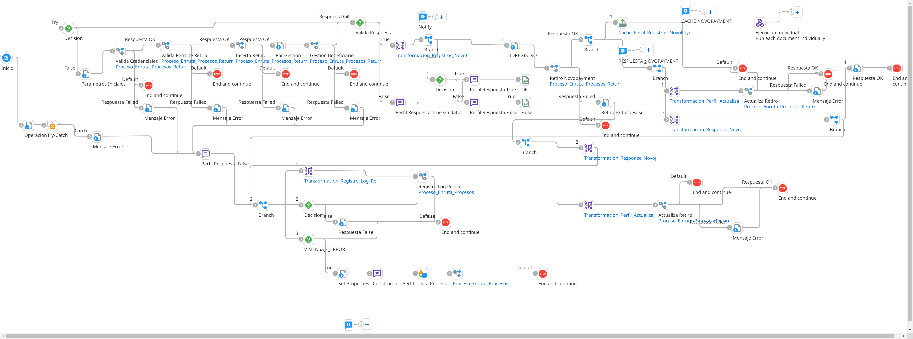

# RETIRO_BENEFICIARIO

## job_Retiro_Beneficiario

Frecuencia de ejecucion: Programado

### Sistemas involucrados: 

- Novopayment (operacion: /sodexo_disableAffiliation)
- Condor BD Oracle

### Descripcion general:
Proceso Job sincronico ejecutado para retirar beneficiarios de forma masiva.   

El proceso inicia cuando un scheduler lanza el Job para retiro masivo de beneficiarios. Para ello se ejecuta en Condor BD `SP_RETIRO_MASIVO` y si se cumplen las validaciones iniciales, se lanza el subproceso principal `ri_Retiro_Beneficiario` en el que se hace un llamado al API Novopayment (`sodexo_disableAffiliation`) y luego se actualiza Condor ejecutando `SP_ACTUALIZAR_ESTADO_RETIRO`.

## ws_Retiro_Beneficiario

Frecuencia de ejecucion: a demanda de usuario

### Sistemas involucrados: 

- Boomi API (/ws/simple/executeRetiroBeneficiario)
- Novopayment (operacion: /sodexo_disableAffiliation)
- Condor BD Oracle

### Descripcion general:
API sincronica ejecutada para retirar beneficiarios.   

El proceso inicia cuando se invoca un API de Boomi (`executeRetiroBeneficiario`) con un objeto JSON que contiene los datos del beneficiario a retirar.  Dicho API lanza el subproceso principal `ri_Retiro_Beneficiario` en el que se hace la ejecucion en Condor DB de los siguientes SP en secuencia: `SP_WSVALIDAR_CREDENCIALES`, `SP_VALIDAR_PERMITE_RETIRO`, `SP_INSERTAR_RETIROBENEFICIARIO`, `SP_GESTION_RETIRO_BENEFICIARIO`. Luego de esto si se cumplen las validaciones, se invoca el API de Novopayment con la operacion `sodexo_disableAffiliation` y finalmente se ejecuta en Condor BD `SP_ACTUALIZAR_ESTADO_RETIRO`

### Actividades del proceso: 
Subproceso principal: `ri_Retiro_Beneficiario`

