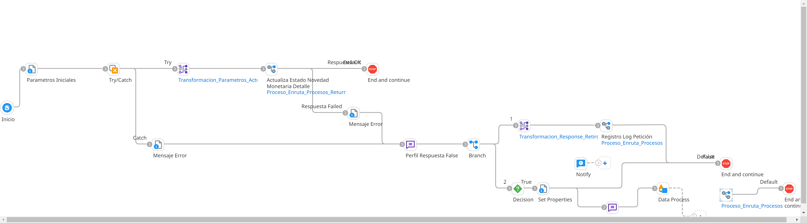

# CONFIRMACION_RETIRO_MONTO

## ws_Confirmacion_Retiro_Monto

Frecuencia de ejecución: por demanda (segun confirmación de Novopayment)

### Sistemas involucrados: 

- Boomi API (Webhook REST JSON: /ws/simple/executeConfirmarRetiroMonto)
- Novopayment 
- Condor BD Oracle

### Descripcion general:
Proceso asincrónico ejecutado para confirmar la solicitud de retiro de dinero de una cuenta/tarjeta en Novopayment. Ver diagrama del proceso, paso 18 en adelante. 

El proceso inicia cuando Novopayment recibe una solicitud de retiro (débito) de una cuenta. Se realiza procesamiento interno en Novo y una vez este listo, consume un API de Boomi (webhook) que se encarga de enviar el recibido (acknowledge) a Novo y encolar la confirmación en `Cola_Confirmacion_Retiro_Monto`. De forma asincrónica un listener (worker) escucha un nuevo mensaje en la cola de confirmación y lanza la ejecución del subproceso principal `ri_Confirmacion_Retiro_Monto` que se encarga de ejecutar `SP_CONFIRMACION_RETIRO_MONTO` en Condor BD. 

### Actividades del proceso: 
Subproceso principal: `ri_Confirmacion_Retiro_Monto`

