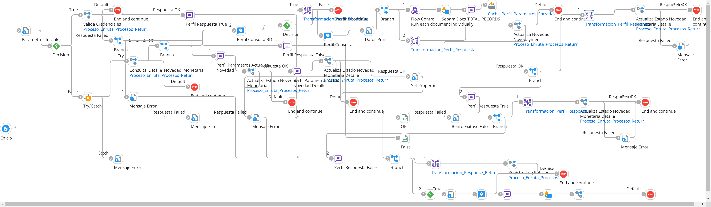

# RETIRO_MONTO

## ws_Retiro_Monto

Frecuencia de ejecucion: por demanda (segun solicitud del usuario)

### Sistemas involucrados: 

- Boomi API (Webhook REST JSON: /ws/simple/executeRetiroMonto)
- Novopayment (operacion: /sodexo_debit)
- Condor BD Oracle

### Descripcion general:
Proceso asincronico ejecutado para retirar dinero de una cuenta/tarjeta.   

El proceso inicia cuando un usuario lanza la peticion de retiro de monto de una tarjeta/cuenta. Para ello el sistema origen consume un API de Boomi (webhook) que se encarga de lanzar el subproceso principal `ri_Retiro_Monto` en el que se validan credenciales consultando en Condor BD y se retorna respuesta de recibido (acknowledge) a la solicitud del webhook (OK o error) de forma sincronica. 

Si la validacion de credenciales es correcta, se procede a encolar la solicitud en `Cola_Retiro_Monto`. 

De forma asincronica un listener (worker) escucha un nuevo mensaje en la cola y lanza la ejecucion del subproceso principal `ri_Retiro_Monto` ahora en modo asincrónico que se encarga de ejecutar varios SP en Condor BD, transformar datos e ir a Novopayment para aplicar el débito (retiro). Finalmente con la respuesta (acknowledge) de Novo, se actualiza la novedad en Condor.  

### Actividades del proceso: 
Subproceso principal: `ri_Retiro_Monto`

