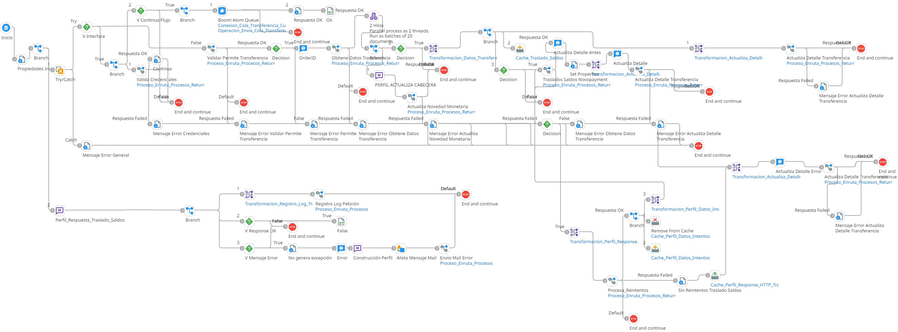

# TRANSFERENCIA CUENTA MAESTRA

## ws_Transferencia_CMaestra

Frecuencia de ejecucion: a demanda

### Sistemas involucrados: 

- Condor BD Oracle
- Novopayment: /sodexo_transfer

### Descripcion general:
Este proceso se de la gestión de transferencias de cuenta maestra.Primero se ejecuta en condor `SP_WSVALIDAR_CREDENCIALES` y si pasa la validacion pone un mensaje en la cola `Cola_Transferencia_Cuenta_Maestra`. Un proceso asincronico escucha el nuevo mensaje en la cola que primero ejecuta en condor BD `SP_VALIDAR_PERMITE_TRANSFEREN` y si se valida correctamente ejecuta `SP_GET_DATOS_TRANSFERENCIA`. Luego de esto ejecuta `SP_UPDATE_NOVEDADMONETARIA` y `SP_UPDATE_DETAIL_TRANS`. Una vez realizado el proceso en condor se ejecuta API Novo con la operacion `sodexo_transfer`

### Actividades del proceso: 
Subproceso principal: `ri_Transferencia_Cuenta_Maestra`

